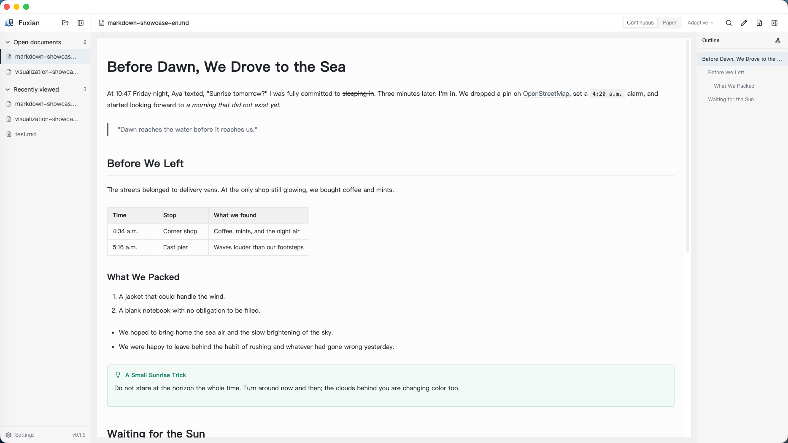
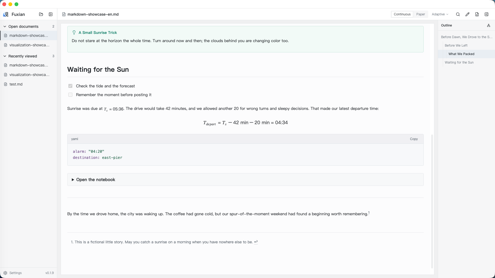
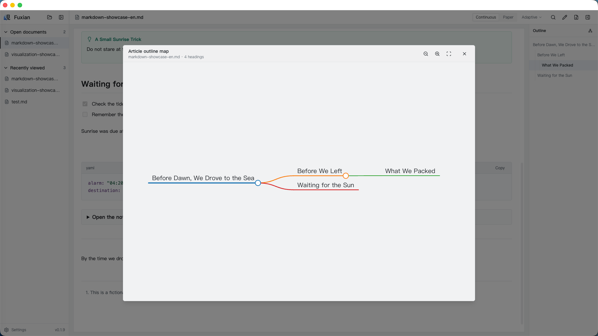
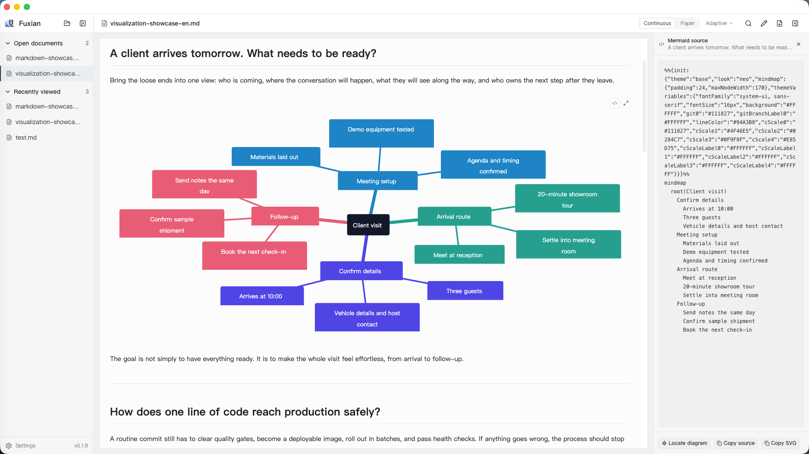
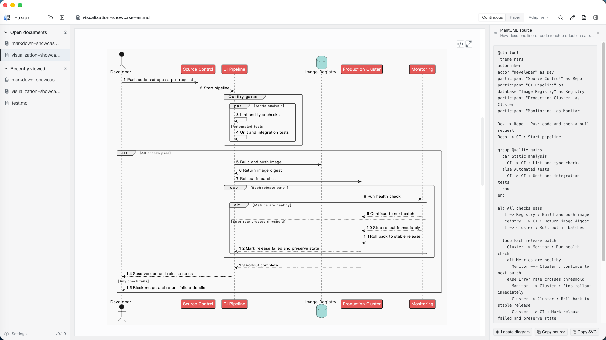
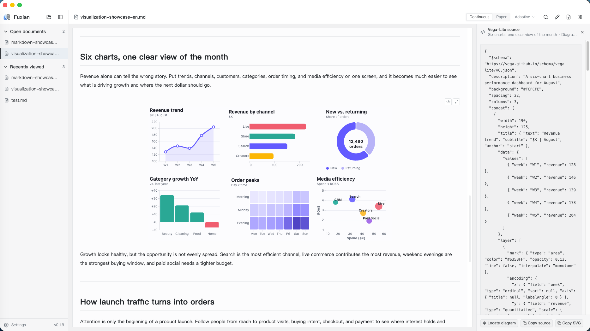
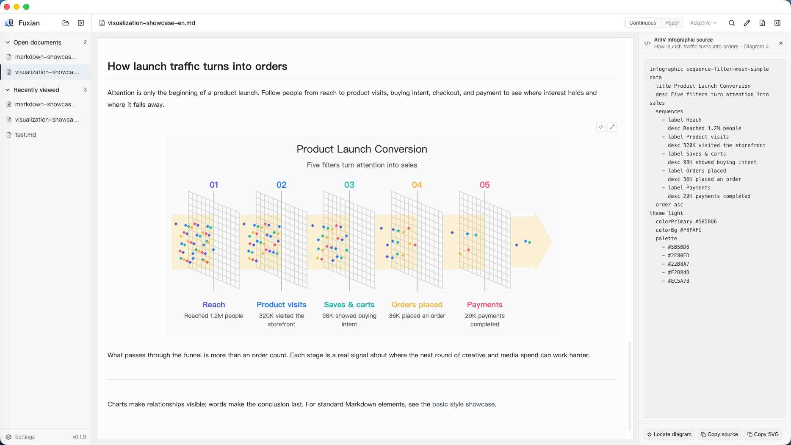

<p align="center">
  
</p>

<h1 align="center">Fuxian</h1>

<p align="center"><strong>Bring content to life. Make Markdown worth reading.</strong></p>

<p align="center">
  A Markdown desktop reader for Windows and macOS, built for reading rather than wrestling with source.<br />
  Turn Markdown from AI and other tools into something polished, readable, and ready to present, share, or export as PDF.
</p>

<p align="center">
  <a href="https://github.com/def-peter/fuxian/releases/latest"></a>
  
  <a href="LICENSE"></a>
</p>

<p align="center">
  English · <a href="README.zh-CN.md">简体中文</a>
</p>

## ✨ Make more of your Markdown

### 📊 One document. Four visualization engines.

An AI-generated plan, a colleague's analysis, your own notes: the diagram code inside them deserves to be seen. Fuxian has built-in support for [Mermaid](https://mermaid.js.org/), [PlantUML](https://plantuml.com/), [Vega-Lite](https://vega.github.io/vega-lite/), and [AntV Infographic](https://infographic.antv.vision/), bringing processes, relationships, data, and visual stories into the same Markdown document.

Open a visual full screen for a closer look, or copy its source or SVG to use elsewhere. The visuals stay with the document as you read, present, and share it as a PDF.

### 📖 Easy to open. Comfortable to read. Ready to share.

- **Open a file and settle in.** Open `.md` or `.markdown` files directly, with headings, tables, code, math, and local images laid out for reading. Adjust the font, text size, line spacing, and page width to suit you.
- **Find your way through longer reads.** Jump to a section from the heading outline, or open the article outline map to see how the ideas fit together.
- **Pick up where you left off.** Switch freely between documents. When you quit and relaunch Fuxian, your open documents return with your place saved in each one.
- **Spot a typo? Fix it as you read.** Switch to source editing, make a change or find and replace text, then save and return to reading. Light editing, with reading at the center.
- **Give others a copy they can read anywhere.** Check pagination and layout in A4 paper preview, then export a PDF. Recipients can read and print it without installing Fuxian.

> **A document does not end with the final word. It ends when the reader understands.**

## 🖼️ See it in action

The source stays in the background. The content comes forward.

### Markdown that reads like a real article

Headings, prose, quotes, tables, lists, and callouts settle into one calm, continuous reading surface, with the outline always close at hand.



Further down the page, task lists, math, code, collapsible sections, and footnotes still feel like part of the same article. There is no need to jump between tools.



### See the shape of an article at a glance

Use the outline to move between sections, or open the article outline map to see how the whole document fits together.



### Four visual languages, each at home in the document

Mermaid, PlantUML, Vega-Lite, and AntV Infographic all render right inside the document. Each framework can express a wide range of structures; the four examples below are simply a few ways they can fit into real work. The source is one click away when you need to check it; for reading and PDF export, the result stays crisp, selectable SVG.

**Mermaid example: a mind map for preparing a client visit.**



**PlantUML example: a sequence diagram that follows code into production.**



**Vega-Lite example: six charts combined into a monthly business dashboard.**



**AntV Infographic example: a visual story of how launch traffic becomes orders.**



## 📥 Download

Visit [GitHub Releases](https://github.com/def-peter/fuxian/releases/latest) for Windows x64, macOS Apple Silicon, and macOS Intel builds.

> [!IMPORTANT]
> Current builds are unsigned. Windows may show an unknown publisher or SmartScreen warning. On macOS, you may need to allow the app manually under **System Settings > Privacy & Security**.

## 🛠️ Development

You will need Node.js 22.12 or later and pnpm 11.18 managed through Corepack.

```bash
pnpm install
pnpm dev
```

Before submitting a change, run:

```bash
pnpm format:check && pnpm lint && pnpm typecheck && pnpm test
```

See [`docs/release.md`](docs/release.md) for the release process and [`skill/fuxian-diagram-authoring`](skill/fuxian-diagram-authoring/SKILL.md) for the companion visual-authoring skill.

## 💬 Feedback

Use [GitHub Issues](https://github.com/def-peter/fuxian/issues) for bug reports and feature requests.

## 📄 License

Created by Peter Li. Fuxian is released under the [MIT License](LICENSE).
