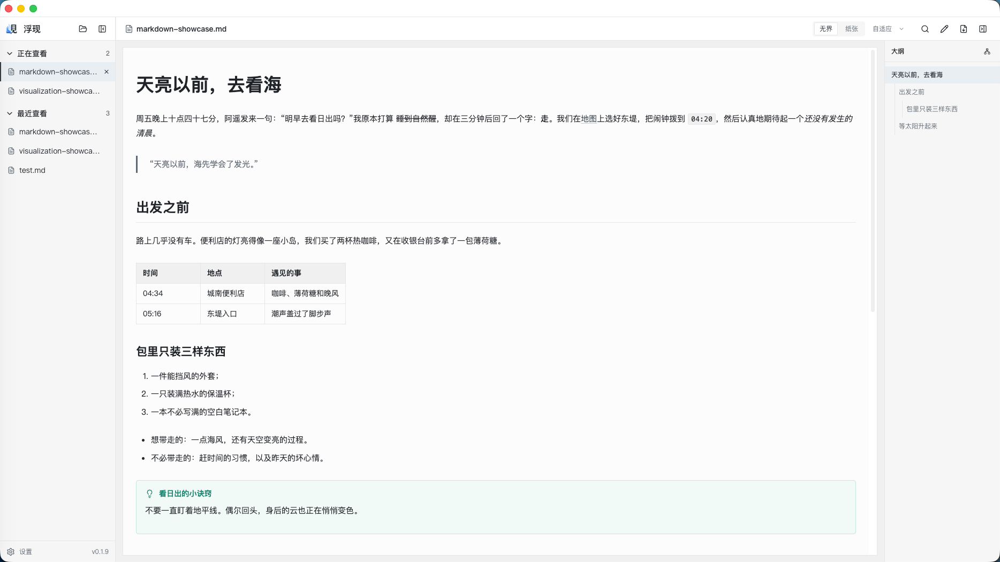
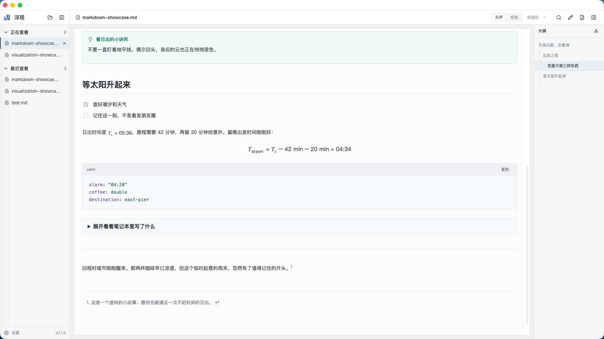
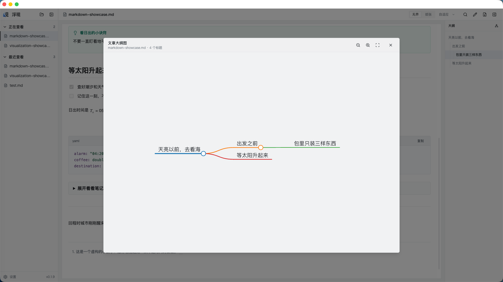
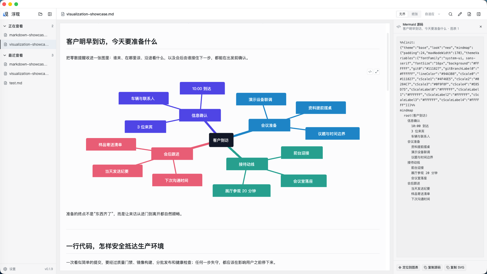
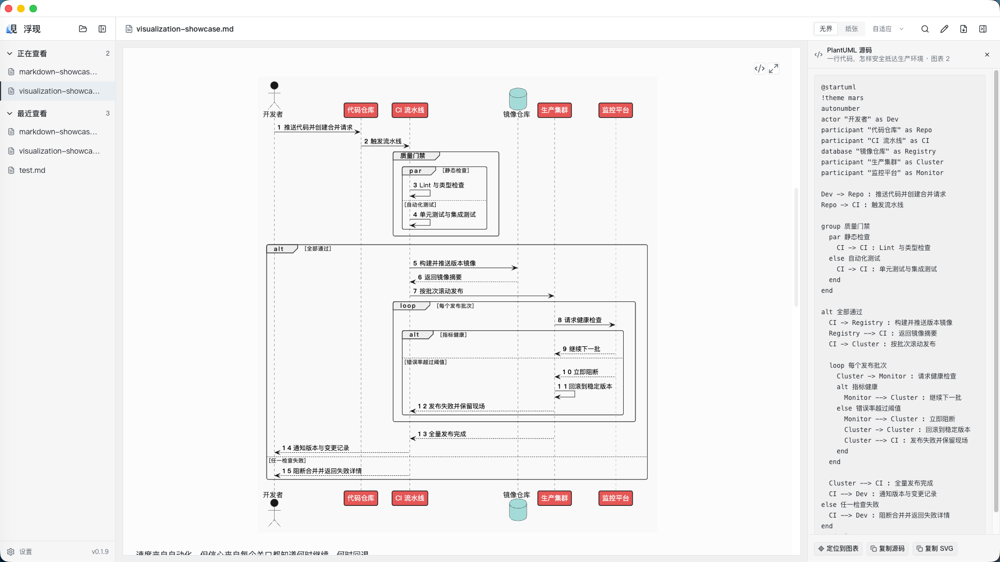
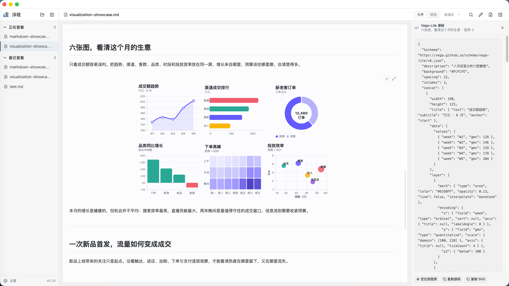
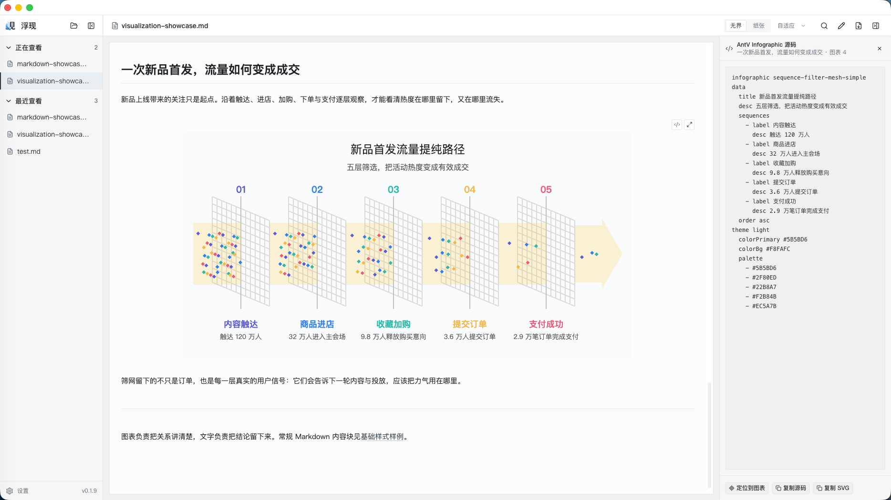

<p align="center">
  
</p>

<p align="center">
  简体中文 · <a href="README.md">English</a>
</p>

<h1 align="center">浮现</h1>

<p align="center"><strong>让内容精彩浮现，让 Markdown 值得阅读。</strong></p>

<p align="center">
  面向 Windows 和 macOS，专注阅读体验的 Markdown 桌面应用。<br />
  让来自 AI 或其他工具的 Markdown 更易读，也方便演示、分享和导出 PDF。
</p>

<p align="center">
  <a href="https://github.com/def-peter/fuxian/releases/latest"></a>
  
  <a href="LICENSE"></a>
</p>

## ✨ 让 Markdown 更值得阅读

### 📊 一份文档，四种图表引擎

AI 给出的方案、同事分享的分析、自己整理的笔记，里面的图表代码也能直接读成图。浮现内置 [Mermaid](https://mermaid.js.org/)、[PlantUML](https://plantuml.com/)、[Vega-Lite](https://vega.github.io/vega-lite/) 和 [AntV Infographic](https://infographic.antv.vision/) 支持，让流程、关系、数据与故事在同一篇 Markdown 中展开。

需要看细节时，全屏放大；想复用时，复制源码或 SVG。从阅读、演示到 PDF 分享，图表都能跟着文档走。

### 📖 从打开到看懂，再到分享

- **打开文件，进入阅读。** 直接打开 `.md` 或 `.markdown`，标题、表格、代码、公式与本地图片自然排开。字体、字号、行距和页面宽度，都可以调到适合自己的节奏。
- **长文也能快速找到方向。** 用标题大纲跳转到关心的章节，或展开文章大纲图，一眼看清内容之间的层次。
- **下次打开，接着读。** 多份文档之间自由切换；退出应用后再次启动，打开的文档与各自的阅读位置会一起恢复。
- **发现一处要改，顺手改好。** 切换到源码编辑，修改文字、查找替换，保存后继续阅读。轻编辑，重阅读。
- **把好读的内容分享出去。** 切换到 A4 纸张预览，先看分页和版式，再导出 PDF。对方无需安装浮现，也能阅读和打印。

> **文档的终点，不是写完，而是让人看懂。**

## 🖼️ 实际效果

源码安静地留在背后，真正值得阅读的内容浮现在眼前。

### 一篇 Markdown，也可以读得像一篇好文章

标题、段落、引用、表格、清单和提示块被整理进安静、连贯的阅读版面，大纲始终在手边。



继续向下，任务清单、公式、代码、折叠内容和脚注仍然属于同一篇文章，不需要在工具之间来回切换。



### 从目录快速看懂结构

除了沿着右侧大纲跳转，还可以把整篇文章的标题关系展开成一张大纲图。



### 四种图表，四种表达方式

Mermaid、PlantUML、Vega-Lite 和 AntV Infographic 都会直接成为文档的一部分。每种框架都能表达丰富的结构，下面只是四个贴近工作的场景示例。需要核对时，可以随时查看源码；阅读和导出时，看到的始终是清晰的 SVG 图形。

**Mermaid 示例：用思维导图梳理一场客户到访。**



**PlantUML 示例：用顺序图追踪一次代码发布。**



**Vega-Lite 示例：用六张图组成一页经营看板。**



**AntV Infographic 示例：用信息图拆解新品首发的转化路径。**



## 📥 下载

前往 [GitHub Releases](https://github.com/def-peter/fuxian/releases/latest) 下载 Windows x64、macOS Apple Silicon 或 macOS Intel 版本。

> [!IMPORTANT]
> 当前安装包尚未签名。Windows 可能显示未知发布者或 SmartScreen 提示；macOS 可能需要在**系统设置 > 隐私与安全性**中手动允许打开。

## 🛠️ 开发

需要 Node.js 22.12 或更高版本，以及由 Corepack 管理的 pnpm 11.18。

```bash
pnpm install
pnpm dev
```

提交前运行：

```bash
pnpm format:check && pnpm lint && pnpm typecheck && pnpm test
```

发布流程见 [`docs/release.md`](docs/release.md)，配套图表创作 Skill 见 [`skill/fuxian-diagram-authoring`](skill/fuxian-diagram-authoring/SKILL.md)。

## 💬 反馈

欢迎通过 [GitHub Issues](https://github.com/def-peter/fuxian/issues) 提交问题和功能建议。

## 📄 许可证

由 Peter Li 创作。浮现使用 [MIT 许可证](LICENSE)发布。
