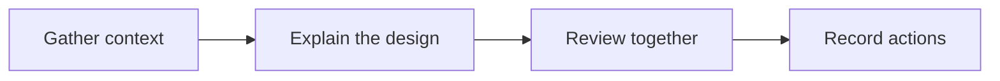

# A clear technical presentation

Explaining a complex proposal starts with a well-structured document. Introduce the context, explain the design and trade-offs, then describe how to validate it and what happens next.

> Reading tip: scan the outline first, then explore the sections that matter to you.

## Start with the problem

### Know your readers

This proposal is for developers, designers, and product leads taking part in a review. Each reader needs different details, but everyone needs to understand why the work matters and how its outcome will be assessed.

### Explain context and goals

Connect the scattered information into a clear story: where things stand, what is difficult, and what this proposal aims to improve. Concrete situations give the design choices a shared context.

### Define the scope

This presentation covers document reading, visual communication, and sharing. Resolve the central questions first, then record ideas for later in the action plan.

## Make the proposal readable

### Build a heading structure

Give each section a question to answer, with subheadings for the details. Readers can navigate through the outline or open the article structure map to see how the sections relate.

### Explain relationships visually

When a paragraph repeatedly describes sequences, dependencies, or branches, show the relationships in a diagram. The text and visual work together to connect the big picture with the details.

### Compare choices in a table

| Format     | Suited to                   | How to read it       |
| ---------- | --------------------------- | -------------------- |
| Paragraphs | Context and reasoning       | Follow the argument  |
| Tables     | Differences between options | Compare across rows  |
| Diagrams   | Processes and dependencies  | Start with the whole |

## Validate before sharing

### Check content and examples

Review terminology, links, and examples so that each conclusion has enough context. Update the source when needed, save your changes, and return to reading to check the result.

### Check the paper layout

Switch to paper preview to inspect where sections and diagrams fall on the page. Review margins, page breaks, and table readability so the document is comfortable to read on screen and on paper.

### Export and review the PDF

Open the exported PDF and check that the text, diagrams, and formulas are complete. Share it with participants so they can read and discuss the proposal on their own devices.

## Keep the discussion moving

### Collect review feedback

Organize questions by section, add missing explanations, and record the points of agreement. Keep the reasoning behind decisions so future readers can understand how the proposal developed.

### Record the next steps

- [x] Complete the structure and examples
- [x] Check reading and paper layouts
- [ ] Collect review feedback
- [ ] Update the action plan

A clear document gives the next conversation a better starting point.
