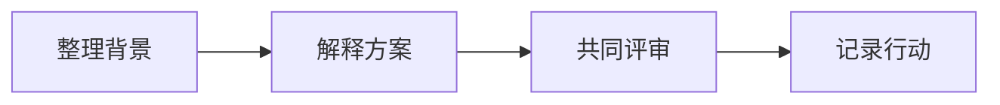

# 一次清晰的技术分享

把一个复杂的方案讲清楚，往往从一份有条理的文档开始。先交代背景，再解释设计与取舍，最后给出验证方法和行动计划。

> 阅读提示：先浏览大纲，把握全貌，再进入关心的章节。

## 从问题开始

### 明确阅读对象

这份方案面向参与评审的开发者、设计师和产品负责人。每个人关注的细节不同，但都需要了解为什么要做、准备怎样做，以及如何判断结果。

### 交代背景与目标

将分散的信息整理成一条清楚的线索：现状是什么，遇到了哪些问题，这一次希望解决什么。用具体场景解释需求，让后续的技术选择有据可依。

### 划定讨论范围

本次分享围绕文档阅读、图形表达与分享流程展开。先把关键问题讨论充分，再把后续想法记录在行动计划中。

## 让方案可读

### 用标题搭起结构

每个章节回答一个问题，次级标题展开必要的细节。读者可以沿着大纲找到位置，也可以通过文章大纲图观察各部分之间的关系。

### 让图形解释关系

当文字需要反复描述顺序、依赖或分支时，用一张图把关系展开。图形与正文互相补充，帮助读者从整体走到细节。

### 用表格比较选择

| 表达方式 | 适用内容       | 阅读方式   |
| -------- | -------------- | ---------- |
| 段落     | 背景与推理     | 按顺序阅读 |
| 表格     | 多个方案的差异 | 横向比较   |
| 图形     | 流程与依赖     | 先看全貌   |

## 在分享前验证

### 检查内容与示例

核对术语、链接和示例，确保每个结论都有相应的上下文。发现需要调整的地方，修改源码并保存，再回到阅读视图检查。

### 检查纸张版式

切换到纸张预览，检查章节与图形在页面中的位置。注意页边距、分页位置，以及表格是否清晰，确保读者在屏幕上和纸上都能顺畅阅读。

### 导出并核对 PDF

导出之后，打开 PDF 确认正文、图形和公式均已完整呈现。将这份文件交给参与者，便于在不同设备上阅读与讨论。

## 让讨论继续

### 汇总评审反馈

把问题按章节整理，补充缺少的解释，记录已经达成的共识。保留必要的决策背景，方便后续参与者理解方案的来由。

### 记录下一步行动

- [x] 完成文档结构与示例
- [x] 检查阅读与纸张版式
- [ ] 收集评审意见
- [ ] 更新行动计划

一份清晰的文档，会让下一次沟通有更好的起点。
