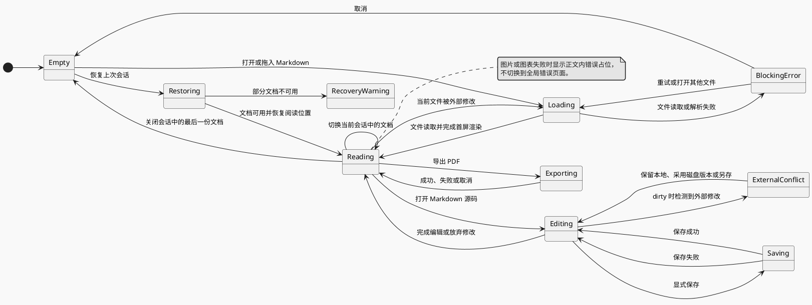

# Fuxian Interface Prototype

> Status: Pencil review draft. This document defines interaction structure and the first visual review set.

## Product Direction

Fuxian should feel like a focused finished-document reader: quieter than an editor, but more discoverable than a minimal viewer. The document remains the visual center. The application shell supplies only navigation and document-level commands.

Design constraints:

- Run as a single application instance while allowing multiple independent Markdown documents to remain open without creating a project or workspace.
- Show open and recent documents as session navigation, not as a folder tree.
- Restore the previous document session and each document's reading position after restart or an unexpected exit.
- Keep the document iframe visually and technically separate from the application shell.
- Use a compact toolbar and a content outline that is visible by default, collapsible, and remembers the user's preference; omit a file tree and status bar.
- Present diagram and media failures inline at their document position.
- Treat empty, loading, error, and export states as part of the primary workflow.
- Apply one width policy to the entire document instead of allowing diagrams to break out independently.

## Main Window Wireframe

Primary desktop review frame: `1440 x 900`, with an additional approximately `1024 x 768` constrained-width state. Measurements are starting points for Pencil, not implementation constants.

| Region            |   Starting size | Responsibility                                                     |
| ----------------- | --------------: | ------------------------------------------------------------------ |
| Toolbar           |      44 px high | TOC toggle, filename, find, export, overflow menu                  |
| Document session  |     216 px wide | Open documents, recent documents, reading progress, recovery state |
| Document viewport | Remaining space | Scroll container for the isolated document iframe                  |
| Reading column    |      760-900 px | Adaptive, A4, or user-controlled document width                    |
| Content outline   |     216 px wide | Current document headings and active-section indicator             |

The document session occupies the left side, the finished document remains dominant in the center, and the content outline occupies the right side. Both side regions are independently collapsible.

Inline document-session and content-outline regions start at `216 px`, can be resized independently from `176 px` through `360 px`, and remember their widths. Double-clicking either divider restores `216 px`; temporary drawers keep their fixed responsive widths.

Each region has its own compact header. The document-session header carries the Fuxian identity and open action; the finished-document header carries the filename, external-revision status, and document actions; the content-outline header names and controls the outline.

At wide widths both side regions are visible. At medium widths the content outline collapses behind an always-visible control while the document session remains visible. At narrow widths both side regions become temporary drawers so the finished document retains usable width.

The implemented shell uses three stable viewport bands: wide at `1100 px` and above, medium from `840 px` through `1099 px`, and narrow below `840 px`. Automatic adaptation never overwrites the user's independently persisted document-session and content-outline preferences.

## Primary State Flow

## State Treatments

| State             | Proposed treatment                                                                           |
| ----------------- | -------------------------------------------------------------------------------------------- |
| Empty             | One primary **Open Markdown** action and full-window drag target; no marketing content       |
| Restoring         | Restore available documents and their reading positions without blocking startup             |
| Recovery warning  | Keep unavailable documents identifiable and offer locate, retry, or remove actions           |
| Loading           | Preserve the shell and document geometry; show restrained progress in the document area      |
| Reading           | Show the content outline by default, remember its collapsed state, and keep commands compact |
| Editing           | Replace the finished document with a source-only editor and expose dirty/save state          |
| Saving            | Keep the editable buffer visible, disable duplicate saves, and report the result             |
| External conflict | Preserve both local and disk versions until the reader chooses a resolution                  |
| Inline error      | Replace failed media or diagrams with source-aware error content and a retry action          |
| Blocking error    | Explain the file-level problem and offer retry or open-another-file actions                  |
| Exporting         | Use a focused dialog with render stages, cancellation, and an explicit failure state         |

## Toolbar Contract

Left side:

1. Content outline toggle.
2. Product name when no file is open; filename when reading.

Right side:

1. Continuous/paper display mode and document width.
2. Find in document, enter editing, and export PDF, in that order.
3. Content outline and lower-frequency commands.

The operating system owns window controls and the application menu. The content layout should remain consistent across macOS and Windows.

## Confirmed Prototype Decisions

- Reading starts on a continuous document surface. The toolbar labels its compact mode switch `无界 / 纸张`, with `连续阅读` and `A4 分页预览` tooltips respectively; paper preview fragments the same finished document into explicit A4 portrait pages before PDF export. View mode is transient and startup always returns to continuous reading.
- Reading and source editing are mutually exclusive active-document modes. Source editing replaces the finished document rather than adding a split preview. The toolbar uses one icon action with the tooltip `进入编辑模式` while reading and `进入阅读模式` while editing, instead of another segmented control. Returning to reading uses the latest explicitly saved source.
- An explicitly saved local revision becomes the reading revision immediately; diagram or media failures remain inline in that revision. A failed external revision may retain the previous successful finished document, but source editing still opens the latest disk source.
- Source editing uses an application-owned edit buffer with Markdown highlighting, line numbers, selection, undo/redo, indentation, and find/replace. `Cmd/Ctrl+S` is the primary save action; Fuxian does not silently autosave source documents.
- A dirty indicator remains visible while the edit buffer differs from its save baseline. Switching or closing the document, quitting the application, and installing an update require the reader to save, discard, or cancel; a crash-recovery draft preserves interrupted work without claiming it was saved.
- Clean edit buffers continue to accept stable external revisions. When an external revision arrives after local changes, Fuxian preserves both versions and asks the reader to keep the local buffer, adopt the disk version, or save the local version elsewhere; it never silently overwrites either side.
- Reading position and source-editor selection are stored independently. Entering source editing does not reinterpret the reading scroll position as an editor position, and returning to reading restores the prior reading context where possible.
- The content outline is open by default, can be collapsed, and remembers the user's choice.
- The first review demonstrates one distinctive Fuxian document theme rather than a theme gallery.
- Content appears progressively as real render tasks settle; diagrams and formulas must not delay readable text.
- Document width controls the entire white finished-document surface, not an inner prose column. Adaptive mode fills the available reading region with small inner gutters so wide diagrams retain space; A4 and custom modes center a white surface at the selected width. Prose, tables, code, formulas, and diagrams share the resulting inner width without independent breakout. Adaptive width is the initial default; the toolbar switches between adaptive, A4, and custom modes, with a drag control for custom width. The user's later choice is remembered.
- The toolbar treats the `无界 / 纸张` switch plus its width-or-page-count slot as one stable document-display control. Width labels, pagination readiness, and page-count changes do not move the mode switch; a restrained gap separates this display control from PDF, find, and outline commands.
- Paper preview is independent of document width. It always uses A4 portrait (`210 × 297 mm`) with compact `14 mm` block and `12 mm` inline margins. Pages stack vertically on the reading-region background with restrained gaps and automatically fit the available reading width. This screen-only scaling never changes pagination. Page shadows, gaps, controls, and loading states never enter PDF output.
- Paper pagination begins only after fonts, images, formulas, and rendered visual blocks settle. A newer external revision or typography change supersedes older pagination; the previous successful pages remain visible until their replacement is complete. Long Markdown tables are divided into bounded row groups with repeated headers before pagination. An individually over-height row becomes a labelled, content-preserving pageable fallback instead of hanging, clipping, or deleting content.
- Mermaid and PlantUML diagram blocks and Vega-Lite visualization blocks remain selectable SVG content. Hover or keyboard focus exposes source and full-screen controls without replacing the rendered visual in place.
- The content-outline header provides an article-structure-map action. It derives a temporary interactive mind map from the active document's existing title hierarchy and opens it in a focused dialog with folding, pan, zoom, and fit controls. It is not a Markdown fence, finished-document block, or PDF content.
- Diagram source opens in a side drawer while the rendered diagram remains visible. Full-screen opens a focused layer with zoom, pan, fit-to-window, and return actions.
- Users can select diagram labels, copy diagram source, and copy the rendered SVG.
- Source-authored diagram styling is always preserved. Fuxian does not rewrite Mermaid or PlantUML source to impose application styling.
- PlantUML initially uses the public server by default and allows a local or private server to be configured.
- Fuxian runs as one application instance with a restorable multi-document session.
- Open documents and recent documents are session navigation, not a representation of the filesystem hierarchy.
- Restart and crash recovery restore the previously open documents, the active document, and each document's reading position.
- Open and recent documents appear on the left; the active document's content outline appears on the right.
- Document items show identity, active state, external-revision state, and recovery state, but never display reading progress. Recent documents still retain their reading positions after they leave the active session.
- Reading progress is not displayed as a percentage, progress bar, or bottom status bar. The viewport scrollbar communicates spatial progress with low contrast while idle and restrained emphasis during interaction; the content outline communicates semantic position.
- Reading positions use the nearest heading and an offset, with relative document progress as a fallback after content changes.
- Unavailable restored documents remain visible with locate, retry, and remove actions instead of blocking startup or disappearing silently.
- Recent documents contain at most the ten most recently opened documents and expire thirty days after their last open time.
- The current successful document remains visible while a revision renders; replacement is atomic, restores the reading position, and falls back to the previous successful version on failure.
- External-revision status appears temporarily beside the filename as `正在更新...` and `已更新 · time`; failures remain visible with retry and details actions.
- When the reader is already near the end, appended content continues to follow. Otherwise the reading position remains stable and a `有新内容` action appears. Text selection disables automatic following.
- External revisions do not highlight changed paragraphs in the finished document.
- The document-session sidebar places the collapsible `正在查看` section above the collapsible `最近查看` section in one scroll region.
- Closing a document moves it to recent history without clearing its reading position. Reopening it returns it to the open-document set. Quitting Fuxian preserves the open-document set rather than closing it.
- The default document theme uses a sans-serif UI, heading, and 15px body face, plus a monospace code face. Readers may switch the finished document body to the serif preset without changing application-shell typography.
- Document typography settings include a serif or sans-serif body preset, body size, and line height. Application-shell typography remains fixed.
- Code highlighting is a global document preference independent of application and document appearance. Fuxian Light is the default; readers may explicitly choose Fuxian Dark, GitHub Light, or GitHub Dark, including a dark code surface inside a light document. Theme choices show representative palette swatches and update the Settings document sample immediately before the user returns to reading.
- Document typography and document width are global preferences without per-document overrides in the MVP.
- The separate settings window includes a compact representative document sample. Appearance changes preview immediately and take effect without an Apply step.
- The default light application shell uses one **white-paper flat** palette across the main and settings windows: `#F0F1F2` for the window canvas and document stage, `#F6F6F7` for quiet navigation regions, pure white for toolbars, panels, overlays, and framed document surfaces, `#E4E6E8` separators, `#24282C` primary text, and near-black primary commands. Hover and selection use restrained neutral surfaces; blue is reserved for keyboard focus and deliberate emphasis, while red is reserved for destructive errors. The finished-document theme remains independently owned by `document-theme`; author-defined content and diagram colors remain unchanged.
- Every open document is watched for external revisions. The active document renders immediately; inactive open documents render at low priority, cancel obsolete work, and retain only the latest revision task.
- Switching to an inactive document whose latest render is incomplete shows its last successful version immediately with `正在更新...` until the latest version is ready.
- Opening a closed document during external writes shows its cached successful version with `正在同步最新内容...` when available, or a stable loading skeleton otherwise. The first settled revision replaces that state atomically.
- Opening diagram source temporarily replaces the right-side content outline with a wider source drawer. Closing the drawer restores the content outline without changing document position.
- Settings use a separate desktop window with general, appearance, document, PlantUML, and “关于与更新” sections. General settings report `.md` and `.markdown` default-app status separately and only open the operating system's confirmation workflow after an explicit user action; the state refreshes when the window regains focus.
- Packaged Windows and macOS builds check the stable update channel after a short non-blocking startup delay. Development builds show that updates are unavailable instead of contacting the production feed.
- The Help menu opens “关于与更新” and starts a manual check. Manual checks distinguish checking, current, available, and failed states; background checks do not interrupt reading.
- Available updates show the target version and plain-text release notes. Download begins only after explicit confirmation, remains cancellable, and reports progress while the reader stays usable.
- A downloaded update offers “重启并更新” and “稍后”. Normal application quit never installs it silently. Installation waits for document-session persistence and is refused while PDF export is active.
- The document-session Settings action changes to a restrained update indicator while an update is available, downloading, or ready, so the state remains discoverable without a modal interruption.
- With no open documents, the central start view shows the Fuxian identity, open/drop actions, and recent documents without feature marketing. The document-session sidebar may collapse in this state to avoid duplicating recent documents.
- The start view initially shows five recent documents in a compact list with a `查看全部` action for the remaining history.
- The finished-document header shows filename and external-revision status on the left, with continuous/paper mode, continuous-layout width controls, find, PDF export, and overflow actions on the right. Paper mode displays its page count without exposing scaling controls.
- The content outline shows headings H1-H3 by default. Deeper headings remain collapsed under their parents, and the active heading is kept visible automatically.
- `Ctrl/Cmd + F` expands an in-header find control with match count, previous, next, and close actions.
- File selection supports multiple Markdown documents. Dropping multiple documents adds all of them to the session, and attempting to open an already-open document activates its existing document item.
- Vega-Lite accepts only the canonical `vega-lite` fence with JSON and bounded `data.values`. It renders locally in cancellable workers, rejects external resources and nondeterministic capabilities, and preserves author styling.
- AntV Infographic accepts only the canonical `infographic` fence and renders supported official built-in templates in a cancellable worker. Static word-cloud, illustration, and `sequence-interaction` layouts are supported; editor interaction remains disabled. Local Lucide/MDI resources are preferred, while online search and SVG loading are restricted to reviewed official-service and Alibaba CDN paths. Downloaded SVG is sanitized and embedded; arbitrary URLs, resource objects, arbitrary attributes, and animation remain disabled. Official template layout and author styling are preserved, and screen, full-screen view, SVG copying, and PDF export share one sanitized snapshot.
- PDF export waits for required snapshots in the active finished-document revision to settle, then reuses its sanitized PlantUML and Vega-Lite SVG snapshots. It does not recompile Vega-Lite in the export window.
- The toolbar shows the filename; the complete path is available in a tooltip.
- After the save location is chosen, PDF export uses a non-modal progress panel so reading can continue.
- PDF export progress appears as a stable, collapsible panel at the lower-right of the finished-document region and briefly confirms completion before dismissing.
- Dark mode is designed after the light layout and default document theme are approved.
- The default Fuxian document theme resembles a modern technical publication rather than generic web documentation or an academic-paper template.
- Heading hierarchy relies on type size, weight, spacing, and restrained rules. It does not add automatic numbering, colored title blocks, or decorative pills.
- Code uses a dedicated surface, tables use fine horizontal rules, quotations use a side rule, and diagrams remain unframed unless interaction or failure requires a boundary.
- Tables use a neutral-gray heading surface, compact vertical padding, and uniform body rows without zebra striping. Continuous reading, paper preview, and PDF export share the same table density. Inline code uses a compact neutral-gray surface and border rather than the document accent color.
- Links retain the same fine one-pixel underline in continuous reading, paper preview, and PDF output.
- Document interaction accents use the Logo's cobalt-blue family for task controls, diagram focus, and text selection. Ordinary blockquotes use a dedicated graphite rule because they express content structure rather than interaction; semantic Callouts retain their family colors. Links remain neutral graphite.
- While Chinese is the only interface language, the document-session header, start view, window title, and system menus use `浮现` without the English name. A future English locale will display `Fuxian`. The finished-document region shows only the active document's identity and actions.
- The application shell uses cool-gray side regions, a cool-white document surface, one-pixel separators, approximately four-pixel control radii, and shadows only for menus, drawers, dialogs, and other overlays.
- Readable text appears immediately. Formulas and diagrams use a restrained approximately 150 ms fade when real rendering completes; ordinary paragraphs do not perform staged entrance animation.
- The application identity combines the standalone mark with a live, locale-specific product title: `浮现` for Chinese and, once supported, `Fuxian` for English. The title remains UI text rather than part of an image so localization, scaling, and accessibility follow the application shell.
- The primary Pencil review uses a `1440 x 900` wide state and an approximately `1024 x 768` narrow state.
- The first revised design review covers the start view, main reading state, external revision, diagram source drawer, diagram full-screen view, PDF export, settings window, session recovery failure, and narrow-window behavior. Dark mode follows later.

## Design Tool Decision

The agreed prototype is produced in Pencil (pen.dev). Pencil is the source for visual structure and component relationships; this repository remains authoritative for product behavior and implementation constraints.

## Pencil Handoff Scope

Create these Pencil frames as the first complete review set:

1. Start view with recent documents and open/drop actions.
2. Light main reading window with open/recent documents, a realistic long document, and a content outline.
3. External-revision state while preserving the last successful render.
4. Diagram source drawer and diagram full-screen view.
5. Non-modal PDF export panel.
6. Settings window with a live document sample.
7. Restored-session partial-failure state.
8. Constrained-width window showing responsive panel behavior.

Reusable components should include the toolbar icon button, document row, TOC row, inline status, export stage, and tooltip. Pencil should use semantic layer names, variables for color/type/spacing, and component instances for repeated controls. It may refine spacing, typography, colors, focus states, and platform details without changing the workflow defined here unless the change is recorded in this document.
