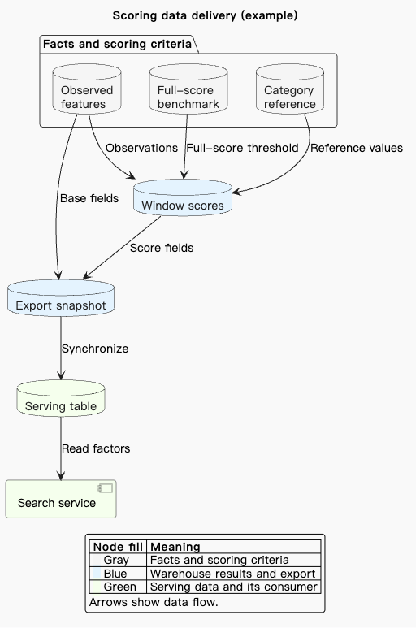

# PlantUML 连线标签与配色校验

核查日期：2026-09-16。针对用户报告的结构图连线标签偏离，以及自定义节点颜色没有说明的问题。业务表名与原始图留在本地归档；本文及 skill 示例采用通用名称。

## 原因与修正

原图用隐藏向下连线将三个独立输入表强制纵向排列，三条输入汇入同一结果节点，另有一条跨级旁路。以 PlantUML 1.2026.7 / Graphviz 15.1.1 本地复现时，标签与长曲线的关联不清楚；去掉这两个隐藏排列约束后，输入自然并列，标签与对应连线更容易关联。修正版保留全部节点标签和七条可见业务关系，包括绕过评分结果、直接进入接口快照的基础字段路径。

这是该图的验证结果，不是禁止隐藏边的通用规则。结构图的标签由布局引擎定位；mars 是主题，不保证标签位置。官方说明隐藏边会影响布局，并特别提示 `linetype ortho` 的标签定位问题，所以不把直角线作为默认修复。[布局引擎与选项](https://plantuml.com/layout-engines)

原图三组自定义填色可解释为事实/评分标尺、仓库结果/接口快照、生产表/消费服务；修正版增加对应图例，并说明统一箭头表示数据流向。节点文字与分组也承载含义。其他图应依据来源定义颜色含义，已有颜色含义未知时不能编造业务分类。[PlantUML 图例语法](https://plantuml.com/commons)

## Skill 改动

- 主指令明确自定义配色需要可见用途说明；用户指定的主题与配色优先。
- 通用视觉检查分别核对标签所属连线、颜色与文字说明的对应关系。主题装饰色不要求逐个加图例。
- PlantUML 排错指南增加修复顺序：检查关联、减少不必要约束、调整组织和方向、必要时尝试并验证折线或拆图。保留真实关系，不通过虚构业务节点或修改 SVG 来修饰结果。
- 结构图指南增加七条关系的通用数据流示例，展示独立输入、旁路及颜色图例。见 [示例源码](../../skills/fuxian-diagram/references/plantuml/architecture-deployment.md#dataflow-with-labeled-inputs-and-explained-colors)。

## 验证范围

三个输入分别为归一化原图、修正版和英文通用示例；归一化仅还原粘贴文本中的 HTML 空格实体及 Markdown 转义。三者均由本地 PlantUML CLI 实际生成 SVG；随后用仅监听本机的临时 HTTP 服务，将请求源码与已编译源码逐一匹配，再将真实 SVG 交给隐藏的 Fuxian 窗口，检查净化和文档中的布局。

在 1440 与 1024 两种窗口宽度下，共六次渲染成功。实际目视检查了修正版与通用示例的窄窗口截图，核对七个标签、箭头方向、旁路和图例。窗口宽度并非图宽。本次没有执行 PDF 分页或独立代理生成评测，也不能保证其他 PlantUML 服务版本产生相同布局。

Skill 格式、英文内容、相对链接及锚点检查通过；原有节点与关系对比通过；现有 skill contract 测试 53 项通过。该测试检查示例围栏识别，不能替代本次真实编译和视觉检查。

原图、修正版 Markdown/PlantUML、布局对比、完整截图和本地渲染脚本保存在仓库外的本次开发归档中。
