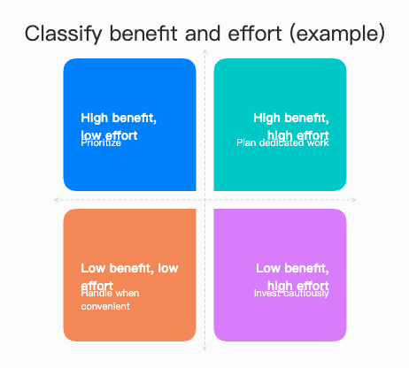
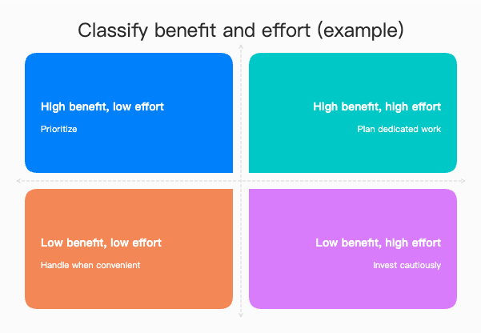

# Fuxian Diagram 验证与发布摘要

记录日期：2026-09-15。发布源码：[3e6bed2](https://github.com/def-peter/fuxian/commit/3e6bed2987cf3d8543d420cc525d5efd6bf59335)。本文汇总已执行工作的证据与边界，不将渲染成功等同于全部语义和版面通过。

## 研究与演进

[官方文档核查](fuxian-diagram-official-docs-review.md) 保留优化前发现及来源；[首版来源历史](fuxian-diagram-evaluation/2026-09-15-baseline/source-history.md) 仅用于追溯。Skill 内的维护入口已改为官方文档、Issues 和发布记录。

后续版本明确了内容锚定、选型、验证与失败交付流程；保留用户指定优先、PlantUML mars 默认主题及 Vega-Lite Ant Design 默认配色。英文转换覆盖主指令、38 份参考文档、示例和三组测试提示词，生成结果仍按用户或目标文档语言输出。图形目录区分已有指南、需验证的引擎候选类型和目标环境限制。

早期优化采用三组提示词、每题一次独立生成及三位配对评审。评审对首次输出整体均判持平：报销审批示例更好，另两题基线略优；后续截图反馈修复单独记录。这不能证明所有图形的生成质量普遍提升，也不能把基线分数或偏好票数当作最终版本评分。

## 英文版本验证

运行环境：Mermaid 11.17.2、Vega-Lite 6.4.3 / Vega 6.4.0、AntV Infographic 0.2.20；PlantUML 使用配置的服务，未固定服务版本。

| 检查                       | 已执行结果                                                                                                          |
| -------------------------- | ------------------------------------------------------------------------------------------------------------------- |
| Skill 结构、格式及本地链接 | 通过；39 份指令/参考文档为英文，本地路径和标题锚点可解析                                                            |
| 现有 skill contract 测试   | 52 项通过                                                                                                           |
| 完整示例预检               | 50 个：PlantUML 16、Mermaid 10、Vega-Lite 13、Infographic 11；Vega-Lite JSON 解析通过，Infographic 解析无错误或警告 |
| 模板目录                   | 目录中 23 处模板名引用均存在于注册表；后续入口目录新增的 9 个候选名称也已核查。名称存在不代表可见字段或排版通过     |
| 隐藏 Electron 渲染         | 50 个示例分别在 1440、1024 窗口宽度下渲染，共 100 次成功，未检测到语法错误 SVG                                      |
| 目视抽查                   | 检查 18 个代表性示例的窄窗口截图，覆盖审批条件、时序分支、甘特标签、全部细分信息图示例、统计比较和分面              |
| 排版修复复验               | 四象限英文标签重叠修复后，再次通过两种窗口宽度渲染，并目视确认窄窗口截图                                            |
| 图形目录补充               | 所有 50 个已渲染示例内容保持不变；新增候选类型未据此宣称已通过渲染验证                                              |

窗口宽度不等于图宽，也不代表移动端验证。未执行新的 PDF 分页检查或英文/双语生成行为评测；仅上述代表性示例经过目视抽查。

## 保留的排版证据

`quarter-simple-card` 默认卡片宽度使较长英文标题换行，与说明重叠。示例显式设置卡片宽度为 260 后，四组收益/工作量条件及建议均保留且可读。源码见 [Infographic comparison](../../skills/fuxian-diagram/references/infographic/comparison.md)。

修复前：

修复后：

## 仍需跟进的发现

核对发布源码后，官方核查中的以下建议尚不能记为全部完成：Mermaid 异步示例应明确展示的是任务结束后的一次查询；Vega-Lite 缺测指导尚可补充缺行、null 与过滤的差别及断线示例；Infographic 关系图尚可明确 ID 唯一性检查。具体依据与验收建议保留在官方核查报告中。

早期同页渲染还观察到 Vega SVG 渐变 ID 冲突：不同图包含同名 `gradient_0`，后图图例采用前图的蓝色渐变；单独渲染时正常。该现象已加入 skill 排错指导，原始复现材料保存在开发归档；此次 skill 更新未修改应用运行时代码，不能宣称产品问题已修复。

## 发布记录

GitHub 源码已推送至 `main`。SkillHub 1.1.0 提交被接收：skill ID 200833，version ID 314653，共 43 个文件，指纹 `f22b88e7714ee26e04d64e1425e82599c036d8e14a95a631f59f28ac6c327d39`。

提交时审核、内容审核和安全扫描均为 pending；当时公开详情仍返回 1.0.1，版本签名查询返回“找不到该版本”。这是提交时的历史状态，后续状态应查询 [SkillHub](https://skillhub.cn/skills/fuxian-diagram)，不能将旧版安全报告当作新版审核通过。

发布副本与提交源码一致，仅增加平台元数据，以及将 LICENSE 改为 LICENSE.txt 并调整 README 链接。原始回执、哈希清单、发布压缩包和完整评测材料保存在仓库外开发归档中；仓库保留研究结论与两张直接支持排版修复的证据图。
