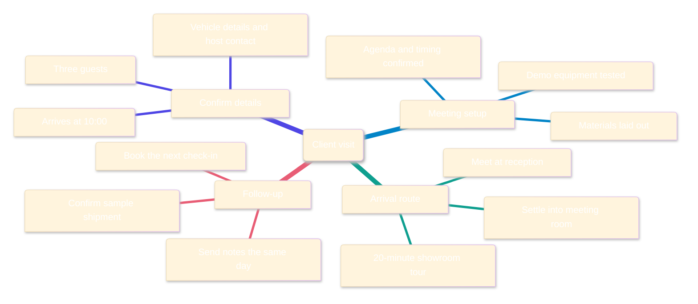
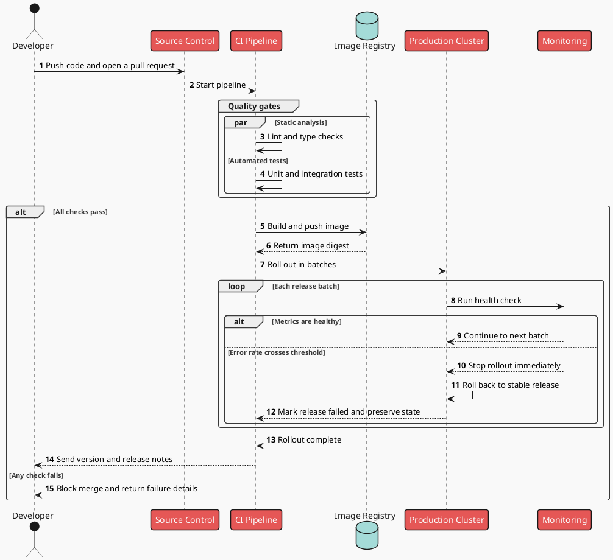

# Four Visuals, Four Ways of Working

One Markdown file can help you plan a client visit, trace a release to production, understand a month of business performance, or unpack a product launch. A visual is not decoration; it makes complexity easier to see.

## A client arrives tomorrow. What needs to be ready?

Bring the loose ends into one view: who is coming, where the conversation will happen, what they will see along the way, and who owns the next step after they leave.



The goal is not simply to have everything ready. It is to make the whole visit feel effortless, from arrival to follow-up.

---

## How does one line of code reach production safely?

A routine commit still has to clear quality gates, become a deployable image, roll out in batches, and pass health checks. If anything goes wrong, the process should stop before users feel it.



Automation brings speed. Confidence comes from knowing exactly when to proceed and when to roll back.

> [!WARNING] Data boundary
> PlantUML source is sent to the server configured in Settings. For internal systems, endpoints, or data, use a trusted self-hosted or private service.

---

## Six charts, one clear view of the month

Revenue alone can tell the wrong story. Put trends, channels, customers, categories, order timing, and media efficiency on one screen, and it becomes much easier to see what is driving growth and where the next dollar should go.

```vega-lite
{
  "$schema": "https://vega.github.io/schema/vega-lite/v6.json",
  "description": "A six-chart business performance dashboard for August",
  "background": "#FCFCFE",
  "spacing": 22,
  "columns": 3,
  "concat": [
    {
      "width": 190,
      "height": 125,
      "title": { "text": "Revenue trend", "subtitle": "$K | August", "anchor": "start" },
      "data": {
        "values": [
          { "week": "W1", "revenue": 128 },
          { "week": "W2", "revenue": 146 },
          { "week": "W3", "revenue": 139 },
          { "week": "W4", "revenue": 178 },
          { "week": "W5", "revenue": 204 }
        ]
      },
      "layer": [
        {
          "mark": { "type": "area", "color": "#635BFF", "opacity": 0.13, "line": false, "interpolate": "monotone" },
          "encoding": {
            "x": { "field": "week", "type": "ordinal", "sort": null, "axis": { "title": null, "labelAngle": 0 } },
            "y": { "field": "revenue", "type": "quantitative", "scale": { "domain": [100, 220] }, "axis": { "title": null, "tickCount": 4 } },
            "y2": { "datum": 100 }
          }
        },
        {
          "mark": { "type": "line", "color": "#635BFF", "strokeWidth": 3, "interpolate": "monotone", "point": { "filled": true, "fill": "#FFFFFF", "stroke": "#635BFF", "strokeWidth": 2, "size": 58 } },
          "encoding": {
            "x": { "field": "week", "type": "ordinal", "sort": null },
            "y": { "field": "revenue", "type": "quantitative" },
            "tooltip": [
              { "field": "week", "title": "Week" },
              { "field": "revenue", "title": "Revenue ($K)" }
            ]
          }
        }
      ]
    },
    {
      "width": 190,
      "height": 125,
      "title": { "text": "Revenue by channel", "subtitle": "$K", "anchor": "start" },
      "data": {
        "values": [
          { "channel": "Live", "revenue": 226 },
          { "channel": "Store", "revenue": 182 },
          { "channel": "Search", "revenue": 151 },
          { "channel": "Creators", "revenue": 96 }
        ]
      },
      "mark": { "type": "bar", "cornerRadiusEnd": 5, "height": 18 },
      "encoding": {
        "y": { "field": "channel", "type": "nominal", "sort": "-x", "axis": { "title": null, "domain": false, "ticks": false } },
        "x": { "field": "revenue", "type": "quantitative", "axis": { "title": null, "grid": false, "tickCount": 3 } },
        "color": { "field": "channel", "type": "nominal", "scale": { "domain": ["Live", "Store", "Search", "Creators"], "range": ["#F05D6F", "#00A896", "#635BFF", "#FFB703"] }, "legend": null },
        "tooltip": [
          { "field": "channel", "title": "Channel" },
          { "field": "revenue", "title": "Revenue ($K)" }
        ]
      }
    },
    {
      "width": 190,
      "height": 125,
      "title": { "text": "New vs. returning", "subtitle": "Share of orders", "anchor": "start" },
      "data": {
        "values": [
          { "customer": "New", "orders": 62 },
          { "customer": "Returning", "orders": 38 }
        ]
      },
      "layer": [
        {
          "mark": { "type": "arc", "innerRadius": 38, "outerRadius": 61, "cornerRadius": 4, "padAngle": 0.035 },
          "encoding": {
            "theta": { "field": "orders", "type": "quantitative", "stack": true },
            "color": { "field": "customer", "type": "nominal", "scale": { "domain": ["New", "Returning"], "range": ["#635BFF", "#B8B3F8"] }, "legend": { "title": null, "orient": "bottom", "direction": "horizontal" } },
            "tooltip": [
              { "field": "customer", "title": "Customer" },
              { "field": "orders", "title": "Share of orders", "format": ".0f" }
            ]
          }
        },
        {
          "data": { "values": [{ "label": "12,480\norders" }] },
          "mark": { "type": "text", "align": "center", "baseline": "middle", "fontSize": 13, "fontWeight": 700, "lineBreak": "\n", "lineHeight": 16, "color": "#20222A" },
          "encoding": { "text": { "field": "label" } }
        }
      ]
    },
    {
      "width": 190,
      "height": 125,
      "title": { "text": "Category growth YoY", "subtitle": "vs. last year", "anchor": "start" },
      "data": {
        "values": [
          { "category": "Beauty", "growth": 34 },
          { "category": "Cleaning", "growth": 21 },
          { "category": "Food", "growth": 12 },
          { "category": "Home", "growth": -7 }
        ]
      },
      "mark": { "type": "bar", "cornerRadiusEnd": 4 },
      "encoding": {
        "x": { "field": "category", "type": "nominal", "sort": "-y", "axis": { "title": null, "labelAngle": 0 } },
        "y": { "field": "growth", "type": "quantitative", "scale": { "domain": [-10, 40] }, "axis": { "title": null, "format": "+.0f", "tickCount": 4 } },
        "color": { "condition": { "test": "datum.growth >= 0", "value": "#00A896" }, "value": "#F05D6F" },
        "tooltip": [
          { "field": "category", "title": "Category" },
          { "field": "growth", "title": "YoY", "format": "+.0f" }
        ]
      }
    },
    {
      "width": 190,
      "height": 125,
      "title": { "text": "Order peaks", "subtitle": "Day x time", "anchor": "start" },
      "data": {
        "values": [
          { "day": "Mon", "period": "Morning", "orders": 42 }, { "day": "Mon", "period": "Midday", "orders": 68 }, { "day": "Mon", "period": "Evening", "orders": 91 },
          { "day": "Tue", "period": "Morning", "orders": 39 }, { "day": "Tue", "period": "Midday", "orders": 61 }, { "day": "Tue", "period": "Evening", "orders": 88 },
          { "day": "Wed", "period": "Morning", "orders": 45 }, { "day": "Wed", "period": "Midday", "orders": 73 }, { "day": "Wed", "period": "Evening", "orders": 96 },
          { "day": "Thu", "period": "Morning", "orders": 48 }, { "day": "Thu", "period": "Midday", "orders": 70 }, { "day": "Thu", "period": "Evening", "orders": 101 },
          { "day": "Fri", "period": "Morning", "orders": 53 }, { "day": "Fri", "period": "Midday", "orders": 82 }, { "day": "Fri", "period": "Evening", "orders": 126 },
          { "day": "Sat", "period": "Morning", "orders": 77 }, { "day": "Sat", "period": "Midday", "orders": 108 }, { "day": "Sat", "period": "Evening", "orders": 148 },
          { "day": "Sun", "period": "Morning", "orders": 72 }, { "day": "Sun", "period": "Midday", "orders": 103 }, { "day": "Sun", "period": "Evening", "orders": 139 }
        ]
      },
      "mark": { "type": "rect", "cornerRadius": 3, "stroke": "#FFFFFF", "strokeWidth": 2 },
      "encoding": {
        "x": { "field": "day", "type": "ordinal", "sort": ["Mon", "Tue", "Wed", "Thu", "Fri", "Sat", "Sun"], "axis": { "title": null, "labelAngle": 0 } },
        "y": { "field": "period", "type": "nominal", "sort": ["Morning", "Midday", "Evening"], "axis": { "title": null, "domain": false, "ticks": false } },
        "color": { "field": "orders", "type": "quantitative", "scale": { "domain": [35, 150], "range": ["#F0EFFF", "#C9C5FF", "#8D85FF", "#4B3FC2"] }, "legend": null },
        "tooltip": [
          { "field": "day", "title": "Day" },
          { "field": "period", "title": "Time" },
          { "field": "orders", "title": "Order index" }
        ]
      }
    },
    {
      "width": 190,
      "height": 125,
      "title": { "text": "Media efficiency", "subtitle": "Spend x ROAS", "anchor": "start" },
      "data": {
        "values": [
          { "channel": "Search", "spend": 32, "roas": 4.1, "orders": 1860 },
          { "channel": "Live", "spend": 54, "roas": 3.4, "orders": 2780 },
          { "channel": "Creators", "spend": 41, "roas": 2.7, "orders": 1590 },
          { "channel": "Paid Social", "spend": 46, "roas": 1.9, "orders": 1320 },
          { "channel": "CRM", "spend": 18, "roas": 3.8, "orders": 1040 }
        ]
      },
      "layer": [
        {
          "mark": { "type": "point", "filled": true, "opacity": 0.88, "stroke": "#FFFFFF", "strokeWidth": 1.5 },
          "encoding": {
            "x": { "field": "spend", "type": "quantitative", "scale": { "domain": [10, 60] }, "axis": { "title": "Spend ($K)", "tickCount": 4 } },
            "y": { "field": "roas", "type": "quantitative", "scale": { "domain": [1.5, 4.5] }, "axis": { "title": "ROAS", "tickCount": 4 } },
            "size": { "field": "orders", "type": "quantitative", "scale": { "range": [120, 620] }, "legend": null },
            "color": { "field": "channel", "type": "nominal", "scale": { "domain": ["Search", "Live", "Creators", "Paid Social", "CRM"], "range": ["#635BFF", "#F05D6F", "#FFB703", "#9B5DE5", "#00A896"] }, "legend": null },
            "tooltip": [
              { "field": "channel", "title": "Channel" },
              { "field": "spend", "title": "Spend ($K)" },
              { "field": "roas", "title": "ROAS", "format": ".1f" }
            ]
          }
        },
        {
          "mark": { "type": "text", "dx": 8, "dy": -8, "fontSize": 10, "fontWeight": 600, "color": "#343741" },
          "encoding": {
            "x": { "field": "spend", "type": "quantitative" },
            "y": { "field": "roas", "type": "quantitative" },
            "text": { "field": "channel" }
          }
        }
      ]
    }
  ],
  "resolve": { "scale": { "color": "independent" } },
  "config": {
    "font": "system-ui, sans-serif",
    "view": { "stroke": null },
    "axis": {
      "labelColor": "#69707D",
      "labelFontSize": 10,
      "titleColor": "#69707D",
      "titleFontSize": 10,
      "domainColor": "#D7D9E0",
      "tickColor": "#D7D9E0",
      "gridColor": "#E8E9F0",
      "gridOpacity": 0.9
    },
    "title": {
      "color": "#20222A",
      "fontSize": 15,
      "fontWeight": 700,
      "subtitleColor": "#7A7F8B",
      "subtitleFontSize": 10,
      "offset": 10
    },
    "legend": {
      "labelColor": "#69707D",
      "labelFontSize": 10,
      "symbolSize": 70
    }
  }
}
```

Growth looks healthy, but the opportunity is not evenly spread. Search is the most efficient channel, live commerce contributes the most revenue, weekend evenings are the strongest buying window, and paid social needs a tighter budget.

---

## How launch traffic turns into orders

Attention is only the beginning of a product launch. Follow people from reach to product visits, buying intent, checkout, and payment to see where interest holds and where it falls away.

```infographic
infographic sequence-filter-mesh-simple
data
  title Product Launch Conversion
  desc Five filters turn attention into sales
  sequences
    - label Reach
      desc Reached 1.2M people
    - label Product visits
      desc 320K visited the storefront
    - label Saves & carts
      desc 98K showed buying intent
    - label Orders placed
      desc 36K placed an order
    - label Payments
      desc 29K payments completed
  order asc
theme light
  colorPrimary #5B5BD6
  colorBg #F8FAFC
  palette
    - #5B5BD6
    - #2F80ED
    - #22B8A7
    - #F2B84B
    - #EC5A7B
```

What passes through the funnel is more than an order count. Each stage is a real signal about where the next round of creative and media spend can work harder.

---

Charts make relationships visible; words make the conclusion last. For standard Markdown elements, see the [basic style showcase](markdown-showcase-en.md).
