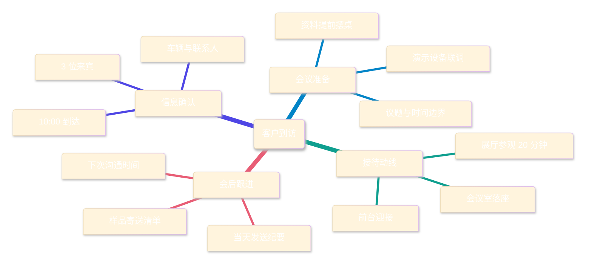
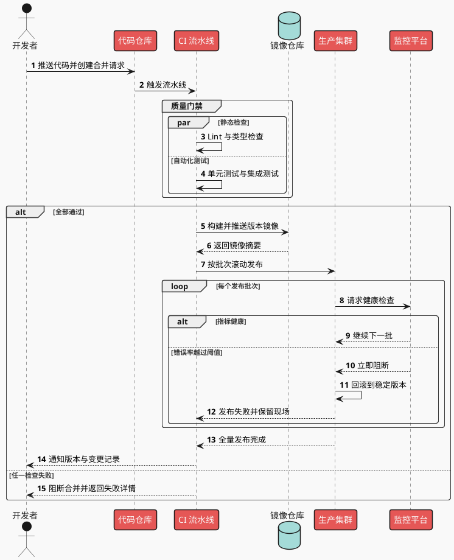

# 四张图，四个工作现场

同一份 Markdown，可以梳理一场接待、讲清一次发布、看懂一盘生意，也可以复盘一次新品首发。图表不是装饰，它让复杂的事更快进入视野。

## 客户明早到访，今天要准备什么

把零散提醒收进一张图里：谁来、在哪里谈、沿途看什么，以及会后由谁接住下一步，都能在出发前确认。



准备的终点不是“东西齐了”，而是让来访从进门到离开都自然顺畅。

---

## 一行代码，怎样安全抵达生产环境

一次看似简单的提交，要经过质量门禁、镜像构建、分批发布和健康检查；任何一步失守，都应该在影响用户之前停下来。



速度来自自动化，但信心来自每个关口都知道何时继续、何时回退。

> [!WARNING] 数据边界
> PlantUML 源码会发送到设置中配置的服务。涉及内部系统、接口或数据时，请使用可信的本地或私有服务。

---

## 六张图，看清这个月的生意

只看成交额容易误判。把趋势、渠道、客群、品类、时段和投放效率放在同一屏，增长来自哪里、预算该往哪里挪，会清楚得多。

```vega-lite
{
  "$schema": "https://vega.github.io/schema/vega-lite/v6.json",
  "description": "八月经营分析六图看板",
  "background": "#FCFCFE",
  "spacing": 22,
  "columns": 3,
  "concat": [
    {
      "width": 190,
      "height": 125,
      "title": { "text": "成交额趋势", "subtitle": "万元 · 8 月", "anchor": "start" },
      "data": {
        "values": [
          { "week": "W1", "gmv": 128 },
          { "week": "W2", "gmv": 146 },
          { "week": "W3", "gmv": 139 },
          { "week": "W4", "gmv": 178 },
          { "week": "W5", "gmv": 204 }
        ]
      },
      "layer": [
        {
          "mark": { "type": "area", "color": "#635BFF", "opacity": 0.13, "line": false, "interpolate": "monotone" },
          "encoding": {
            "x": { "field": "week", "type": "ordinal", "sort": null, "axis": { "title": null, "labelAngle": 0 } },
            "y": { "field": "gmv", "type": "quantitative", "scale": { "domain": [100, 220] }, "axis": { "title": null, "tickCount": 4 } },
            "y2": { "datum": 100 }
          }
        },
        {
          "mark": { "type": "line", "color": "#635BFF", "strokeWidth": 3, "interpolate": "monotone", "point": { "filled": true, "fill": "#FFFFFF", "stroke": "#635BFF", "strokeWidth": 2, "size": 58 } },
          "encoding": {
            "x": { "field": "week", "type": "ordinal", "sort": null },
            "y": { "field": "gmv", "type": "quantitative" },
            "tooltip": [
              { "field": "week", "title": "周" },
              { "field": "gmv", "title": "成交额（万元）" }
            ]
          }
        }
      ]
    },
    {
      "width": 190,
      "height": 125,
      "title": { "text": "渠道成交排行", "subtitle": "万元", "anchor": "start" },
      "data": {
        "values": [
          { "channel": "直播", "gmv": 226 },
          { "channel": "商城", "gmv": 182 },
          { "channel": "搜索", "gmv": 151 },
          { "channel": "达人", "gmv": 96 }
        ]
      },
      "mark": { "type": "bar", "cornerRadiusEnd": 5, "height": 18 },
      "encoding": {
        "y": { "field": "channel", "type": "nominal", "sort": "-x", "axis": { "title": null, "domain": false, "ticks": false } },
        "x": { "field": "gmv", "type": "quantitative", "axis": { "title": null, "grid": false, "tickCount": 3 } },
        "color": { "field": "channel", "type": "nominal", "scale": { "domain": ["直播", "商城", "搜索", "达人"], "range": ["#F05D6F", "#00A896", "#635BFF", "#FFB703"] }, "legend": null },
        "tooltip": [
          { "field": "channel", "title": "渠道" },
          { "field": "gmv", "title": "成交额（万元）" }
        ]
      }
    },
    {
      "width": 190,
      "height": 125,
      "title": { "text": "新老客订单", "subtitle": "订单占比", "anchor": "start" },
      "data": {
        "values": [
          { "customer": "新客", "orders": 62 },
          { "customer": "老客", "orders": 38 }
        ]
      },
      "layer": [
        {
          "mark": { "type": "arc", "innerRadius": 38, "outerRadius": 61, "cornerRadius": 4, "padAngle": 0.035 },
          "encoding": {
            "theta": { "field": "orders", "type": "quantitative", "stack": true },
            "color": { "field": "customer", "type": "nominal", "scale": { "domain": ["新客", "老客"], "range": ["#635BFF", "#B8B3F8"] }, "legend": { "title": null, "orient": "bottom", "direction": "horizontal" } },
            "tooltip": [
              { "field": "customer", "title": "客群" },
              { "field": "orders", "title": "订单占比", "format": ".0f" }
            ]
          }
        },
        {
          "data": { "values": [{ "label": "12,480\n订单" }] },
          "mark": { "type": "text", "align": "center", "baseline": "middle", "fontSize": 13, "fontWeight": 700, "lineBreak": "\n", "lineHeight": 16, "color": "#20222A" },
          "encoding": { "text": { "field": "label" } }
        }
      ]
    },
    {
      "width": 190,
      "height": 125,
      "title": { "text": "品类同比增长", "subtitle": "较去年同期", "anchor": "start" },
      "data": {
        "values": [
          { "category": "个护", "growth": 34 },
          { "category": "家清", "growth": 21 },
          { "category": "食品", "growth": 12 },
          { "category": "家居", "growth": -7 }
        ]
      },
      "mark": { "type": "bar", "cornerRadiusEnd": 4 },
      "encoding": {
        "x": { "field": "category", "type": "nominal", "sort": "-y", "axis": { "title": null, "labelAngle": 0 } },
        "y": { "field": "growth", "type": "quantitative", "scale": { "domain": [-10, 40] }, "axis": { "title": null, "format": "+.0f", "tickCount": 4 } },
        "color": { "condition": { "test": "datum.growth >= 0", "value": "#00A896" }, "value": "#F05D6F" },
        "tooltip": [
          { "field": "category", "title": "品类" },
          { "field": "growth", "title": "同比", "format": "+.0f" }
        ]
      }
    },
    {
      "width": 190,
      "height": 125,
      "title": { "text": "下单高峰", "subtitle": "星期 × 时段", "anchor": "start" },
      "data": {
        "values": [
          { "day": "周一", "period": "上午", "orders": 42 }, { "day": "周一", "period": "午间", "orders": 68 }, { "day": "周一", "period": "晚间", "orders": 91 },
          { "day": "周二", "period": "上午", "orders": 39 }, { "day": "周二", "period": "午间", "orders": 61 }, { "day": "周二", "period": "晚间", "orders": 88 },
          { "day": "周三", "period": "上午", "orders": 45 }, { "day": "周三", "period": "午间", "orders": 73 }, { "day": "周三", "period": "晚间", "orders": 96 },
          { "day": "周四", "period": "上午", "orders": 48 }, { "day": "周四", "period": "午间", "orders": 70 }, { "day": "周四", "period": "晚间", "orders": 101 },
          { "day": "周五", "period": "上午", "orders": 53 }, { "day": "周五", "period": "午间", "orders": 82 }, { "day": "周五", "period": "晚间", "orders": 126 },
          { "day": "周六", "period": "上午", "orders": 77 }, { "day": "周六", "period": "午间", "orders": 108 }, { "day": "周六", "period": "晚间", "orders": 148 },
          { "day": "周日", "period": "上午", "orders": 72 }, { "day": "周日", "period": "午间", "orders": 103 }, { "day": "周日", "period": "晚间", "orders": 139 }
        ]
      },
      "mark": { "type": "rect", "cornerRadius": 3, "stroke": "#FFFFFF", "strokeWidth": 2 },
      "encoding": {
        "x": { "field": "day", "type": "ordinal", "sort": ["周一", "周二", "周三", "周四", "周五", "周六", "周日"], "axis": { "title": null, "labelAngle": 0 } },
        "y": { "field": "period", "type": "nominal", "sort": ["上午", "午间", "晚间"], "axis": { "title": null, "domain": false, "ticks": false } },
        "color": { "field": "orders", "type": "quantitative", "scale": { "domain": [35, 150], "range": ["#F0EFFF", "#C9C5FF", "#8D85FF", "#4B3FC2"] }, "legend": null },
        "tooltip": [
          { "field": "day", "title": "星期" },
          { "field": "period", "title": "时段" },
          { "field": "orders", "title": "订单指数" }
        ]
      }
    },
    {
      "width": 190,
      "height": 125,
      "title": { "text": "投放效率", "subtitle": "预算 × ROI", "anchor": "start" },
      "data": {
        "values": [
          { "channel": "搜索", "spend": 32, "roi": 4.1, "orders": 1860 },
          { "channel": "直播", "spend": 54, "roi": 3.4, "orders": 2780 },
          { "channel": "达人", "spend": 41, "roi": 2.7, "orders": 1590 },
          { "channel": "信息流", "spend": 46, "roi": 1.9, "orders": 1320 },
          { "channel": "会员", "spend": 18, "roi": 3.8, "orders": 1040 }
        ]
      },
      "layer": [
        {
          "mark": { "type": "point", "filled": true, "opacity": 0.88, "stroke": "#FFFFFF", "strokeWidth": 1.5 },
          "encoding": {
            "x": { "field": "spend", "type": "quantitative", "scale": { "domain": [10, 60] }, "axis": { "title": "预算（万）", "tickCount": 4 } },
            "y": { "field": "roi", "type": "quantitative", "scale": { "domain": [1.5, 4.5] }, "axis": { "title": "ROI", "tickCount": 4 } },
            "size": { "field": "orders", "type": "quantitative", "scale": { "range": [120, 620] }, "legend": null },
            "color": { "field": "channel", "type": "nominal", "scale": { "domain": ["搜索", "直播", "达人", "信息流", "会员"], "range": ["#635BFF", "#F05D6F", "#FFB703", "#9B5DE5", "#00A896"] }, "legend": null },
            "tooltip": [
              { "field": "channel", "title": "渠道" },
              { "field": "spend", "title": "预算（万元）" },
              { "field": "roi", "title": "ROI", "format": ".1f" }
            ]
          }
        },
        {
          "mark": { "type": "text", "dx": 8, "dy": -8, "fontSize": 10, "fontWeight": 600, "color": "#343741" },
          "encoding": {
            "x": { "field": "spend", "type": "quantitative" },
            "y": { "field": "roi", "type": "quantitative" },
            "text": { "field": "channel" }
          }
        }
      ]
    }
  ],
  "resolve": { "scale": { "color": "independent" } },
  "config": {
    "font": "system-ui, sans-serif",
    "view": { "stroke": null },
    "axis": {
      "labelColor": "#69707D",
      "labelFontSize": 10,
      "titleColor": "#69707D",
      "titleFontSize": 10,
      "domainColor": "#D7D9E0",
      "tickColor": "#D7D9E0",
      "gridColor": "#E8E9F0",
      "gridOpacity": 0.9
    },
    "title": {
      "color": "#20222A",
      "fontSize": 15,
      "fontWeight": 700,
      "subtitleColor": "#7A7F8B",
      "subtitleFontSize": 10,
      "offset": 10
    },
    "legend": {
      "labelColor": "#69707D",
      "labelFontSize": 10,
      "symbolSize": 70
    }
  }
}
```

本月的增长是健康的，但机会并不平均：搜索效率最高，直播贡献最大，周末晚间是最值得守住的成交窗口，信息流则需要收紧预算。

---

## 一次新品首发，流量如何变成成交

新品上线带来的关注只是起点。沿着触达、进店、加购、下单与支付逐层观察，才能看清热度在哪里留下，又在哪里流失。

```infographic
infographic sequence-filter-mesh-simple
data
  title 新品首发流量提纯路径
  desc 五层筛选，把活动热度变成有效成交
  sequences
    - label 内容触达
      desc 触达 120 万人
    - label 商品进店
      desc 32 万人进入主会场
    - label 收藏加购
      desc 9.8 万人释放购买意向
    - label 提交订单
      desc 3.6 万人提交订单
    - label 支付成功
      desc 2.9 万笔订单完成支付
  order asc
theme light
  colorPrimary #5B5BD6
  colorBg #F8FAFC
  palette
    - #5B5BD6
    - #2F80ED
    - #22B8A7
    - #F2B84B
    - #EC5A7B
```

筛网留下的不只是订单，也是每一层真实的用户信号：它们会告诉下一轮内容与投放，应该把力气用在哪里。

---

图表负责把关系讲清楚，文字负责把结论留下来。常规 Markdown 内容块见[基础样式样例](markdown-showcase.md)。
