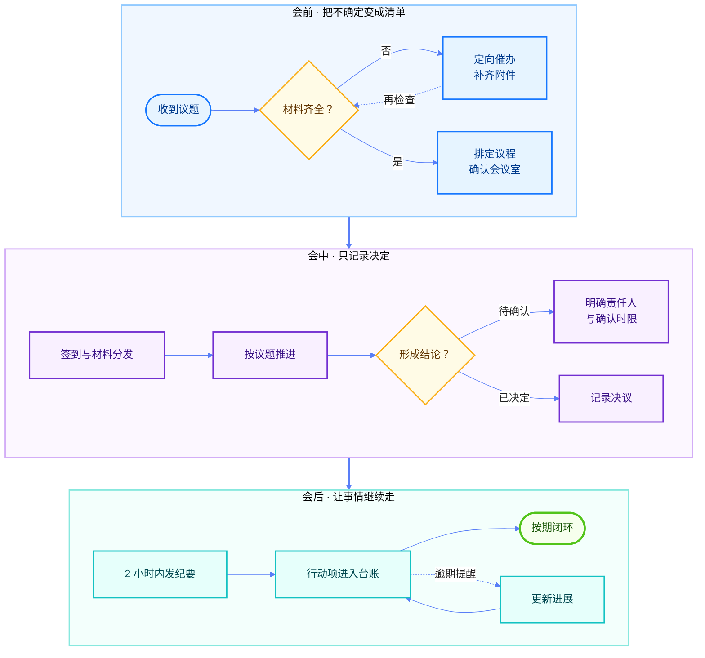
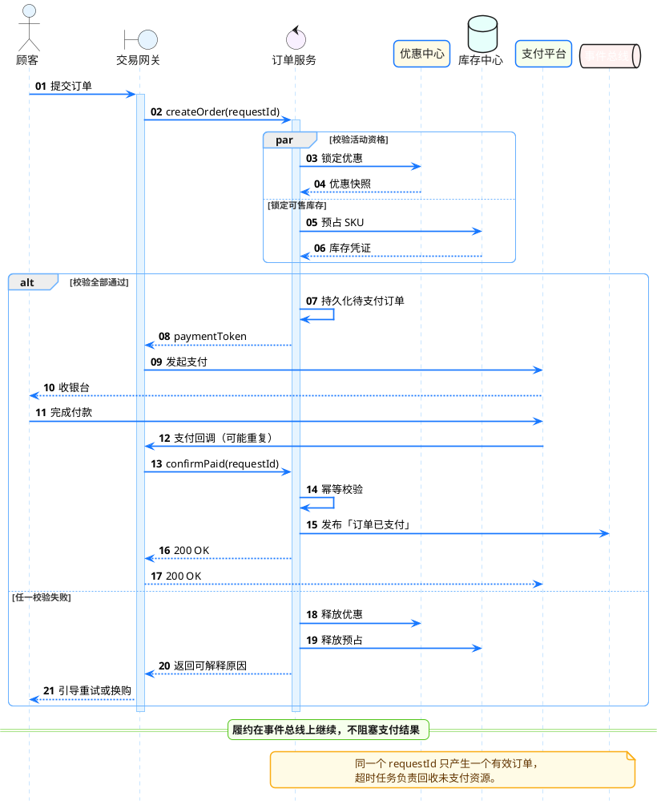

# 四种图表，四个工作现场

**让结构、系统、数据与节奏各自找到合适的表达。**

同一次新品发布，会产生完全不同的问题：会议怎样形成闭环，高峰订单如何安全落地，增长究竟来自哪里，下一轮内容又该如何接力。这份文档不讲图表语法，只展示四种图形在真实工作中的样子。

> [!NOTE] 阅读提示
> 四张图使用相同的虚构发布背景，但分别服务于不同任务。源码、名称与经营数据均为演示内容。

## 让一场会议准时结束

周一 9:30 的发布决策会只有 45 分钟。议题、材料、场地与参会人任何一项迟到，都会把讨论拖成下一轮会议。把临时状况提前画进流程，现场才有余量留给真正的决定。



真正省时间的不是把流程压成一条直线，而是给“材料不齐”和“结论待定”留出明确回路。会议纪要因此不再是一份散会后的记录，而成为下一步行动的起点。

> [!IMPORTANT] 定稿原则
> 会前确认输入，会中只记决定，会后追踪行动。每一步都有负责人、时限与完成条件。

## 承接峰值流量的下单链路

首发当晚的流量会在直播口令出现后瞬间涌入。系统必须先锁定优惠与库存，再创建订单；支付回调即使重复到达，也只能完成一次履约确认。下面这条时序把正常路径、并行校验和补偿分支放在同一张图里。



这条链路守住三个关键约束：

- **先占资源，再生成支付凭证**，避免超卖与优惠穿透。
- **回调必须幂等**，重试不能制造重复订单。
- **履约异步推进**，支付结果不等待下游任务。

> [!WARNING] PlantUML 数据边界
> PlantUML 源码会发送到设置中配置的服务。包含敏感信息时，请改用可信的本地或私有服务。

## 增长究竟来自哪里

首发七天成交额持续抬升，但“整体增长”还不足以指导预算。把趋势与渠道效率放在一起看，才能判断峰值来自自然扩散，还是某个渠道在特定日期真正跑出了效率。

```vega-lite
{
  "$schema": "https://vega.github.io/schema/vega-lite/v6.json",
  "description": "新品首发七天成交趋势与渠道转化热力图",
  "spacing": 28,
  "vconcat": [
    {
      "width": 620,
      "height": 190,
      "title": { "text": "首发七天成交额", "subtitle": "虚线为 55 万元日目标", "anchor": "start" },
      "data": {
        "values": [
          { "day": "D0", "gmv": 38 },
          { "day": "D+1", "gmv": 46 },
          { "day": "D+2", "gmv": 43 },
          { "day": "D+3", "gmv": 58 },
          { "day": "D+4", "gmv": 64 },
          { "day": "D+5", "gmv": 79 },
          { "day": "D+6", "gmv": 86 }
        ]
      },
      "layer": [
        {
          "mark": {
            "type": "area",
            "line": { "color": "#0958D9", "strokeWidth": 3.5 },
            "point": { "filled": true, "fill": "#FFFFFF", "stroke": "#1677FF", "strokeWidth": 2.5, "size": 82 },
            "color": {
              "x1": 1,
              "y1": 1,
              "x2": 1,
              "y2": 0,
              "gradient": "linear",
              "stops": [
                { "offset": 0, "color": "#E6F4FF" },
                { "offset": 1, "color": "#1677FF" }
              ]
            }
          },
          "encoding": {
            "x": { "field": "day", "type": "ordinal", "sort": null, "axis": { "title": null, "labelAngle": 0 } },
            "y": { "field": "gmv", "type": "quantitative", "scale": { "domain": [0, 95] }, "axis": { "title": "成交额（万元）", "gridColor": "#E7EBF0" } },
            "tooltip": [
              { "field": "day", "type": "ordinal", "title": "日期" },
              { "field": "gmv", "type": "quantitative", "title": "成交额（万元）" }
            ]
          }
        },
        {
          "mark": { "type": "rule", "color": "#FA541C", "strokeDash": [7, 5], "strokeWidth": 2.5 },
          "encoding": { "y": { "datum": 55 } }
        },
        {
          "data": { "values": [{ "day": "D+3", "gmv": 58, "note": "达人测评上线" }] },
          "mark": { "type": "text", "align": "left", "dx": 10, "dy": -14, "fontWeight": 700, "color": "#D4380D" },
          "encoding": {
            "x": { "field": "day", "type": "ordinal", "sort": null },
            "y": { "field": "gmv", "type": "quantitative" },
            "text": { "field": "note" }
          }
        },
        {
          "data": { "values": [{ "day": "D+3", "gmv": 58 }] },
          "mark": { "type": "rule", "color": "#FA541C", "strokeDash": [3, 3], "strokeWidth": 1.5 },
          "encoding": { "x": { "field": "day", "type": "ordinal", "sort": null } }
        }
      ]
    },
    {
      "width": 620,
      "height": 185,
      "title": { "text": "渠道转化率热力图", "subtitle": "颜色越深，落地页访问后的成交效率越高", "anchor": "start" },
      "data": {
        "values": [
          { "day": "D0", "channel": "站内推荐", "rate": 0.031 }, { "day": "D+1", "channel": "站内推荐", "rate": 0.034 }, { "day": "D+2", "channel": "站内推荐", "rate": 0.036 }, { "day": "D+3", "channel": "站内推荐", "rate": 0.039 }, { "day": "D+4", "channel": "站内推荐", "rate": 0.041 }, { "day": "D+5", "channel": "站内推荐", "rate": 0.043 }, { "day": "D+6", "channel": "站内推荐", "rate": 0.046 },
          { "day": "D0", "channel": "搜索", "rate": 0.026 }, { "day": "D+1", "channel": "搜索", "rate": 0.028 }, { "day": "D+2", "channel": "搜索", "rate": 0.029 }, { "day": "D+3", "channel": "搜索", "rate": 0.031 }, { "day": "D+4", "channel": "搜索", "rate": 0.033 }, { "day": "D+5", "channel": "搜索", "rate": 0.035 }, { "day": "D+6", "channel": "搜索", "rate": 0.037 },
          { "day": "D0", "channel": "达人内容", "rate": 0.018 }, { "day": "D+1", "channel": "达人内容", "rate": 0.021 }, { "day": "D+2", "channel": "达人内容", "rate": 0.024 }, { "day": "D+3", "channel": "达人内容", "rate": 0.042 }, { "day": "D+4", "channel": "达人内容", "rate": 0.049 }, { "day": "D+5", "channel": "达人内容", "rate": 0.052 }, { "day": "D+6", "channel": "达人内容", "rate": 0.055 },
          { "day": "D0", "channel": "会员触达", "rate": 0.044 }, { "day": "D+1", "channel": "会员触达", "rate": 0.041 }, { "day": "D+2", "channel": "会员触达", "rate": 0.038 }, { "day": "D+3", "channel": "会员触达", "rate": 0.036 }, { "day": "D+4", "channel": "会员触达", "rate": 0.034 }, { "day": "D+5", "channel": "会员触达", "rate": 0.032 }, { "day": "D+6", "channel": "会员触达", "rate": 0.031 }
        ]
      },
      "layer": [
        {
          "mark": { "type": "rect", "cornerRadius": 4, "stroke": "#FFFFFF", "strokeWidth": 3 },
          "encoding": {
            "x": { "field": "day", "type": "ordinal", "sort": null, "axis": { "title": null, "labelAngle": 0, "orient": "top" } },
            "y": { "field": "channel", "type": "nominal", "sort": ["站内推荐", "搜索", "达人内容", "会员触达"], "axis": { "title": null } },
            "color": { "field": "rate", "type": "quantitative", "scale": { "domain": [0.018, 0.055], "range": ["#FFFBE6", "#FFE58F", "#5CDBD3", "#1677FF", "#10239E"] }, "legend": null },
            "tooltip": [
              { "field": "day", "type": "ordinal", "title": "日期" },
              { "field": "channel", "type": "nominal", "title": "渠道" },
              { "field": "rate", "type": "quantitative", "title": "转化率", "format": ".1%" }
            ]
          }
        },
        {
          "mark": { "type": "text", "fontWeight": 600 },
          "encoding": {
            "x": { "field": "day", "type": "ordinal", "sort": null },
            "y": { "field": "channel", "type": "nominal", "sort": ["站内推荐", "搜索", "达人内容", "会员触达"] },
            "text": { "field": "rate", "type": "quantitative", "format": ".1%" },
            "color": { "condition": { "test": "datum.rate >= 0.041", "value": "#FFFFFF" }, "value": "#262626" }
          }
        }
      ]
    }
  ],
  "config": {
    "view": { "stroke": null },
    "axis": { "labelColor": "#595959", "titleColor": "#262626", "domainColor": "#D9D9D9", "tickColor": "#D9D9D9", "gridColor": "#F0F0F0", "labelFontSize": 12, "titleFontSize": 12 },
    "title": { "color": "#1F1F1F", "fontSize": 16, "fontWeight": 700, "subtitleColor": "#8C8C8C", "subtitleFontSize": 11, "offset": 10 }
  }
}
```

> [!SUCCESS] 本周结论
> D+3 上线的达人测评带动成交额越过目标线，且随后三天转化效率持续走高。下一轮预算应向可复用的测评内容倾斜；会员触达更适合承担首发唤醒，而不是持续追投。

这个视图把总量趋势与渠道效率叠在一次阅读里：先确认增长是否发生，再定位增长由谁贡献，最后形成预算调整方向。

## 把上新变成一场接力

下一轮不再把所有信息集中到发布当天，而是让每个阶段只完成一个关键转变：从注意力、兴趣和信任，逐步走向成交，再把结果变成下一次投放的依据。

```infographic
infographic sequence-zigzag-pucks-3d-simple
data
  title 秋日焕新战役
  sequences
    - time D-7
      label 悬念预热
      desc 收藏加购突破 600
    - time D-3
      label 场景种草
      desc 三组穿搭 回答购买理由
    - time D0
      label 首发爆破
      desc 直播 会场 会员权益同步落地
    - time D+2
      label 口碑接力
      desc 买家秀与达人测评消除最后犹豫
    - time D+7
      label 复盘加投
      desc 加投高转化素材 沉淀打法
  order asc
theme
  palette
    - #1677FF
    - #722ED1
    - #13C2C2
    - #FA8C16
    - #52C41A
```

每个节点都对应一个可以验收的结果，彼此又沿着同一条增长路径推进。读者先看到节奏，再读到目标与动作；即使不展开执行表，也能迅速把握整场上新的全局。

---

四种图形解决四种问题，但最终都服务于同一件事：让读者更快看见结构、理解关系并采取行动。常规 Markdown 内容块见[基础样式样例](markdown-showcase.md)，更多信息见 [Fuxian 项目主页](https://github.com/def-peter/fuxian)。
