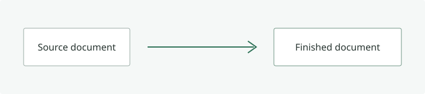

# 浮现 Fuxian 富文档展示

这是一份同时包含 **中文**、English、`inline code` 与[^reader]的 finished document。

> 阅读应当聚焦成品，而不是 Markdown 源码。

## GFM 能力

- [x] 表格与任务列表
- [x] 数学与 Mermaid 图表
- ~~不再需要手动 Reload~~

| 能力       | 状态 | 很长的说明                                                                                                                              |
| ---------- | :--: | --------------------------------------------------------------------------------------------------------------------------------------- |
| CommonMark | 完成 | 即使单元格包含很长的连续内容 `abcdefghijklmnopqrstuvwxyzabcdefghijklmnopqrstuvwxyzabcdefghijklmnopqrstuvwxyz`，也不能撑破文档宽度。     |
| GFM        | 完成 | [这是一个非常非常长的外部链接标签，用来验证换行和版心约束](https://example.com/a/very/long/path/that/must/not/break/the/document/width) |

## 稳定标题

标题 ID 可供后续 content outline 使用。

## 稳定标题

重复标题也必须获得确定且唯一的 ID。

### 这是一个非常非常非常非常非常非常非常非常非常非常长的标题用于验证真实技术文档不会破坏版心

这个段落让较长的内容目录项和正文阅读保持对应。

#### 深层标题

四级标题默认收起，读者需要时可以从父级标题展开查看。

##### 更深层标题

五级标题继续保留文档原本的层级关系。

```typescript
type FinishedDocument = {
  html: string;
  headings: Array<{ id: string; depth: number; text: string }>;
};

const render = (source: string): FinishedDocument => ({
  html: source,
  headings: [],
});
```

```json
{ "safe": true, "reader": "Fuxian" }
```

## 数学与图表

行内公式 $E = mc^2$ 应当与正文自然排列。

$$
\int_0^1 x^2 \, dx = \frac{1}{3}
$$


## 本地资源




<details>
<summary>受控原始 HTML</summary>

允许安全、语义化的 HTML 内容。

</details>

<div onclick="alert('event handler')">事件属性必须被清理。</div>
<script>globalThis.compromised = true</script>
<a href="javascript:alert('unsafe')" onmouseover="alert('unsafe')">危险原始链接</a>

[危险 Markdown 链接](<javascript:alert('unsafe')>)

[^reader]: 脚注是文档结构的一部分，并提供可往返的语义链接。
