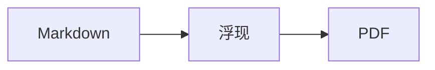
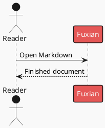

# Fence Syntax

Use standard Markdown fences. Choose a longer outer fence or tildes when the visual source itself contains triple backticks.

## Mermaid

Use the canonical `mermaid` info string and normal Mermaid syntax. Fuxian renders it locally with strict security.

````markdown

````

## PlantUML

Prefer `plantuml`; `puml` is also accepted. Include a complete `@startuml` / `@enduml` document. Fuxian sends the source unchanged to the configured server, which defaults to the public PlantUML service.

````markdown

````

## Vega-Lite

Use `vega-lite` with a valid JSON object. Put rows in `data.values`. Fuxian accepts static specifications with fixed numeric dimensions and rejects external/named data, links, image marks, interactive parameters, and nondeterministic operations.

````markdown
```vega-lite
{
  "data": { "values": [
    { "month": "Jan", "value": 18 },
    { "month": "Feb", "value": 27 }
  ] },
  "mark": "bar",
  "encoding": {
    "x": { "field": "month", "type": "nominal" },
    "y": { "field": "value", "type": "quantitative" }
  }
}
```
````

## AntV Infographic

Use `infographic` with official Infographic Syntax. Start with `infographic <exact-template>`, then provide a `data` block. Use a known official static template; Fuxian rejects animated templates, arbitrary SVG attributes, URLs, data URIs, and local files. `icon` and `illus` accept reviewed local `lucide/...` or `mdi/...` names and bounded trusted search terms.

````markdown
```infographic
infographic list-row-simple-horizontal-arrow
data
  title 发布流程
  lists
    - label 编写
      desc 形成 Markdown 源文档
    - label 阅读
      desc 在浮现中检查成品
    - label 交付
      desc 导出稳定 PDF
```
````

Fuxian preserves accepted author theme choices. For Infographic, keep custom theme fields to supported named themes/palettes or reviewed `colorPrimary` and `colorBg` hexadecimal values.
