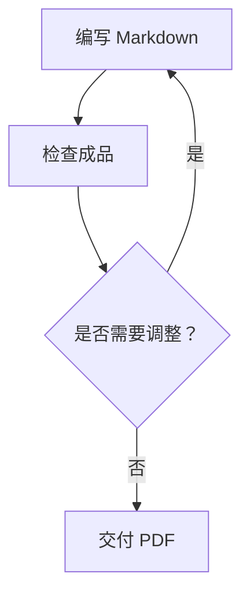
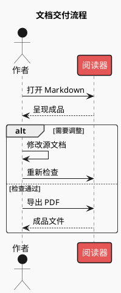

# 完整代码块

以下均为示例内容；使用时替换为来源中的事实与数据。嵌套展示代码块时使用更长的外层围栏，实际交付只需内层围栏。

## Mermaid

````markdown

````

## PlantUML

````markdown

````

## Vega-Lite

````markdown
```vega-lite
{
  "$schema": "https://vega.github.io/schema/vega-lite/v6.json",
  "title": "季度交付数量（示例数据）",
  "width": "container",
  "height": 220,
  "data": {
    "values": [
      {
        "quarter": "Q1",
        "documents": 18
      },
      {
        "quarter": "Q2",
        "documents": 27
      },
      {
        "quarter": "Q3",
        "documents": 23
      }
    ]
  },
  "mark": {
    "type": "bar",
    "color": "#1677FF"
  },
  "encoding": {
    "x": {
      "field": "quarter",
      "type": "ordinal",
      "sort": [
        "Q1",
        "Q2",
        "Q3"
      ],
      "axis": {
        "title": "季度",
        "labelAngle": 0
      }
    },
    "y": {
      "field": "documents",
      "type": "quantitative",
      "scale": {
        "zero": true
      },
      "axis": {
        "title": "文档数（份）",
        "tickMinStep": 1
      }
    }
  },
  "config": {
    "mark": {
      "color": "#1677FF"
    },
    "text": {
      "color": "#262626"
    },
    "range": {
      "category": [
        "#1677FF",
        "#13C2C2",
        "#722ED1",
        "#52C41A",
        "#EB2F96"
      ]
    }
  }
}
```
````

## AntV Infographic

````markdown
```infographic
infographic list-row-simple-horizontal-arrow
data
  title 文档交付要点
  lists
    - label 编写
      desc 准备源文档
    - label 阅读
      desc 检查内容与排版
    - label 交付
      desc 导出成品 PDF
```
````
