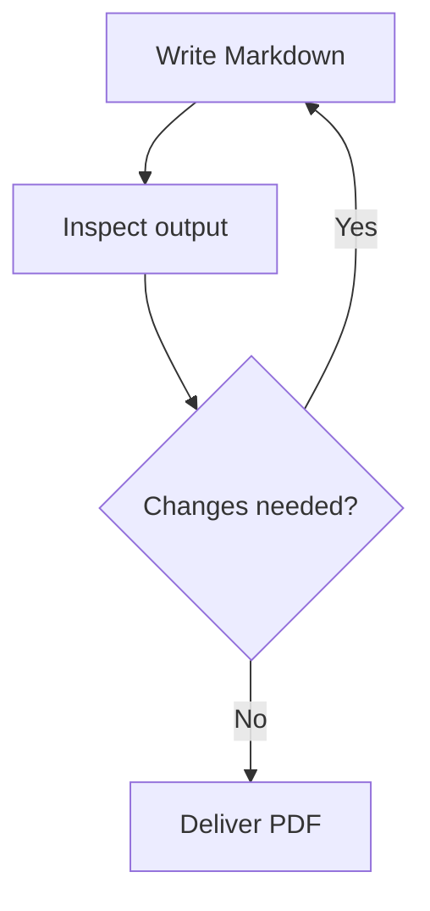
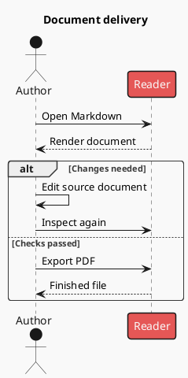

# Complete fences

All content below is illustrative; replace it with facts and data from the source. Use a longer outer fence when showing nested fences. Deliver only the inner fence in the actual document.

## Mermaid

````markdown

````

## PlantUML

````markdown

````

## Vega-Lite

````markdown
```vega-lite
{
  "$schema": "https://vega.github.io/schema/vega-lite/v6.json",
  "title": "Quarterly deliveries (example data)",
  "width": "container",
  "height": 220,
  "data": {
    "values": [
      {
        "quarter": "Q1",
        "documents": 18
      },
      {
        "quarter": "Q2",
        "documents": 27
      },
      {
        "quarter": "Q3",
        "documents": 23
      }
    ]
  },
  "mark": {
    "type": "bar",
    "color": "#1677FF"
  },
  "encoding": {
    "x": {
      "field": "quarter",
      "type": "ordinal",
      "sort": [
        "Q1",
        "Q2",
        "Q3"
      ],
      "axis": {
        "title": "Quarter",
        "labelAngle": 0
      }
    },
    "y": {
      "field": "documents",
      "type": "quantitative",
      "scale": {
        "zero": true
      },
      "axis": {
        "title": "Documents (count)",
        "tickMinStep": 1
      }
    }
  },
  "config": {
    "mark": {
      "color": "#1677FF"
    },
    "text": {
      "color": "#262626"
    },
    "range": {
      "category": [
        "#1677FF",
        "#13C2C2",
        "#722ED1",
        "#52C41A",
        "#EB2F96"
      ]
    }
  }
}
```
````

## AntV Infographic

````markdown
```infographic
infographic list-row-simple-horizontal-arrow
data
  title Document delivery essentials
  lists
    - label Write
      desc Prepare the source document
    - label Read
      desc Check content and layout
    - label Deliver
      desc Export the finished PDF
```
````
