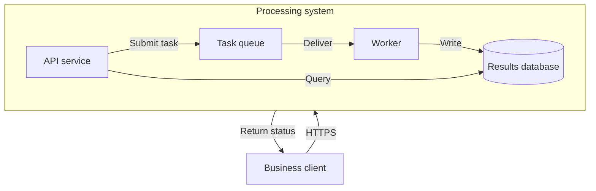

# Architecture, deployment, and code mapping

When Mermaid is requested, ordinary architecture and deployment views can use `flowchart` nodes, groups, and labeled connections. Check the target version for dedicated declarations such as C4 or architecture; another platform's support does not establish support in Fuxian's version.

### Event-driven system overview (example)

Keep nodes at the same abstraction level: runtime services here, without expanding functions or files. Queue arrows represent data delivery, not module imports.

## Extracting evidence

- Application entry points and routes → External callers and system entry points.
- Service interfaces and call implementations → Runtime interactions; configuration establishes availability conditions.
- Docker Compose, deployment manifests, or IaC → Instances, networks, and storage; do not add gateways or caches from framework conventions alone.
- Message publishers, topics, and consumers → Event edges; include facts needed to explain delivery and acknowledgement boundaries.
- Source directories and imports → Module dependencies, not automatically microservice deployment.

See [code-to-diagram.md](../code-to-diagram.md) for the evidence workflow.

## Layout and fallback

Keep actors, system boundaries, and main dataflows in the overview. Expand internal components or deployment topology separately. Label each edge type with its protocol or purpose rather than relying on color. If too many edges cross subgraphs, reconsider the grouping: one diagram should not simultaneously explain organization, network security zones, and call order.

If the target cannot render a dedicated declaration, explain the limitation and preserve the structure with an ordinary flowchart in the same engine. If strict C4 semantics were requested, identify the notation differences introduced by simplification.
