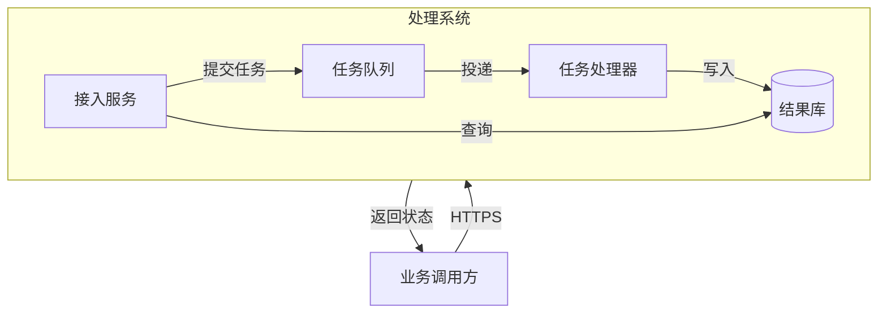

# 架构、部署与代码映射

用户指定 Mermaid 时，常规架构和部署可以用 `flowchart` 的节点、分组与有标签连接表达。C4、architecture 等专用声明需核对目标版本；不要因为上游某个平台支持就假定 Fuxian 的版本也支持相同用法。

### 事件驱动的系统总览（示例）

节点在同一抽象层次上：这里是运行时服务，不展开函数和文件。队列箭头表示数据投递；它不是模块 import 关系。

## 从材料提取

- 应用入口和路由 → 外部调用方、系统入口。
- 服务接口和调用实现 → 运行时交互；配置提供可用性条件。
- Docker Compose、部署清单或 IaC → 实例、网络与存储；不要凭框架惯例添加网关或缓存。
- 消息发布者、topic 与消费者 → 事件边；补充投递与确认边界所需的事实。
- 源码目录和 import → 模块依赖图；不要自动等同于微服务部署。

详细证据流程见 [code-to-diagram.md](../code-to-diagram.md)。

## 布局与降级

总览保留参与者、系统边界和主数据流；内部组件或部署拓扑单独展开。每种边的标签说明协议或作用，不依赖颜色猜含义。子图跨边太多时调整分组依据，避免用同一张图承担“组织结构”“网络安全域”和“调用顺序”三个问题。

目标平台不能渲染某个专用声明时，可以说明限制并用同一引擎的常规 flowchart 保留结构；如果用户要求严格 C4 语义，应明确指出简化后的标记差异。
