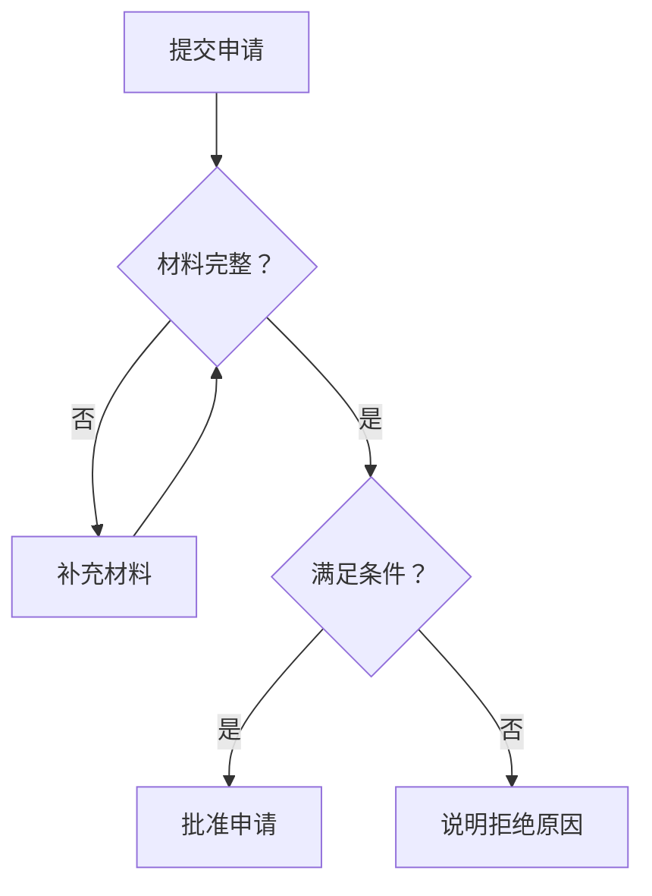
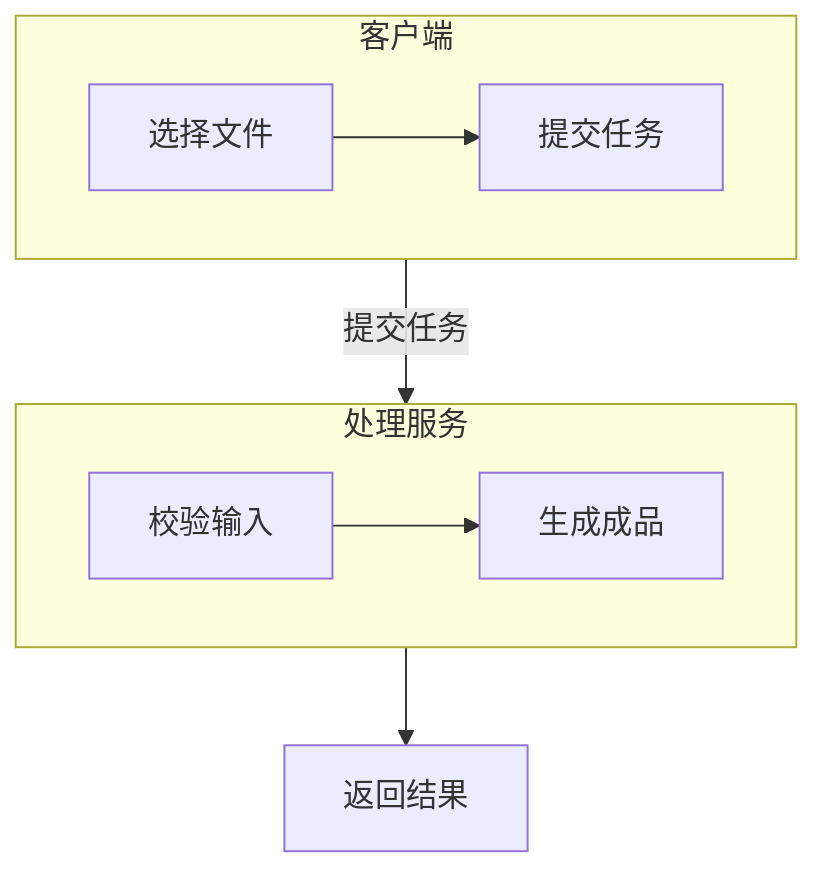

# 流程图：判断、回退与分组

适用于步骤流向、判定规则与轻量依赖。用户指定 Mermaid 时，用 `flowchart` 表达流程；不要因为存在分支就换引擎。

## 源码结构

用稳定英文 ID 和用户语言标签。动作写方括号，判断写花括号，边上写互斥条件；特殊字符放在带双引号的标签内。对每个回退或终止出口核实其真实语义。

### 带补充材料回路的审批（示例）

### 分组表达责任边界（示例）

此总览把交接连到系统边界，内部步骤在各组内展开；需要精确到动作的跨角色交接时使用更详细的流程或泳道。`subgraph` 表示分组，不是真正的 UML 泳道。子图节点与外部直接相连时，内部 `direction` 可能被父图方向覆盖；不能只靠局部方向命令保证排版。

## 改写与校验

- `A --> B`、`A -.-> B`、`A ==> B` 分别可表达普通、虚线、强调连接；它们没有自动业务含义，按图例保持一致。
- 并行分支在普通流程图中不会自动具有 fork/join 语义；明确标注“并行”“全部完成”或用指定引擎更适合的类型。
- 入口、判断、回退与结束应能沿边走通；不要把真实失败出口指回成功路径。
- 图过宽先从 `LR` 改为 `TB`，将长标签换成短标题加正文解释；不要无限减小字号。
- 图形 ID 不用裸 `end`；声明与第一条边分行；引号、括号、`subgraph/end` 都成对。

官方语法：[Flowchart](https://mermaid.js.org/syntax/flowchart.html)。
