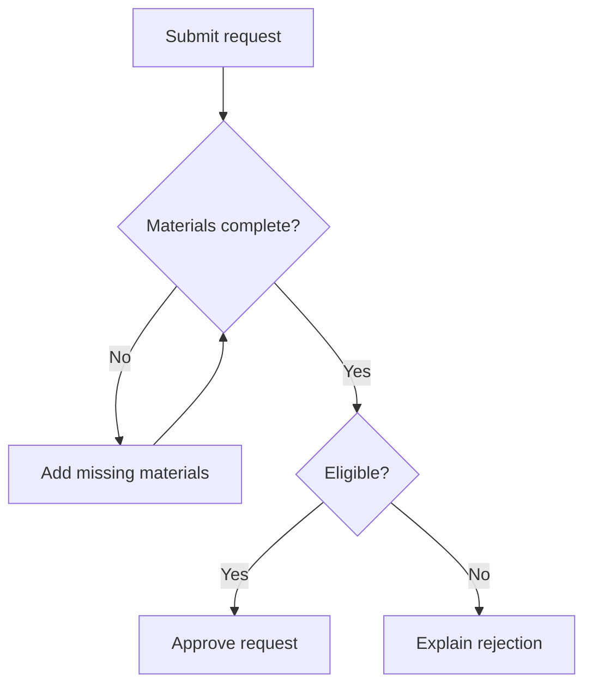
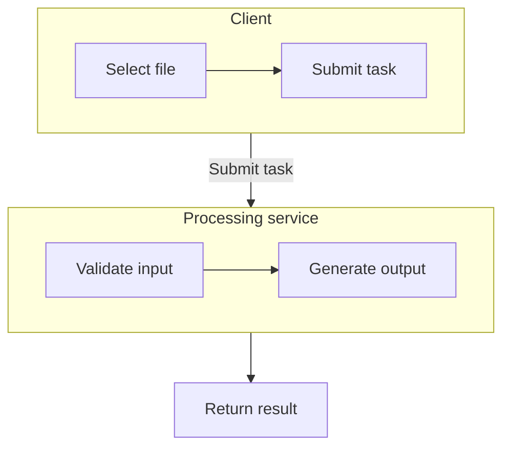

# Flowcharts: decisions, rollback, and grouping

Use for step flow, decision rules, and lightweight dependencies. When Mermaid is specified, use `flowchart` for processes; branches alone are not a reason to change engines.

## Source structure

Use stable English IDs and labels in the user's language. Actions use square brackets, decisions use braces, and edges carry mutually exclusive outcomes. Put special characters inside double-quoted labels. Verify the actual meaning of every rollback or termination exit.

### Approval with a missing-materials loop (example)

### Groups for responsibility boundaries (example)

This overview connects handoffs to system boundaries and expands steps inside each group. Use a detailed process or swimlanes for action-level handoffs across roles. A `subgraph` is a group, not a UML swimlane. Direct links from internal nodes to external nodes may make the parent direction override an internal `direction`; local direction settings alone do not guarantee layout.

## Adaptation and checks

- `A --> B`, `A -.-> B`, and `A ==> B` can express normal, dotted, and emphasized connections. They carry no automatic business meaning; use a consistent legend.
- Ordinary flowchart branches do not automatically have fork/join semantics. Label “parallel” and “all complete” explicitly or use a more suitable type within the specified engine.
- Entry, decisions, rollback, and termination must be traceable along edges. Do not route a genuine failure exit back into success.
- If the diagram is too wide, try `TB` instead of `LR` and replace long labels with short titles plus prose. Do not keep shrinking the font.
- Avoid bare `end` as a node ID. Put the declaration and first edge on separate lines; balance quotes, brackets, and `subgraph/end`.

Official syntax: [Flowchart](https://mermaid.js.org/syntax/flowchart.html).
