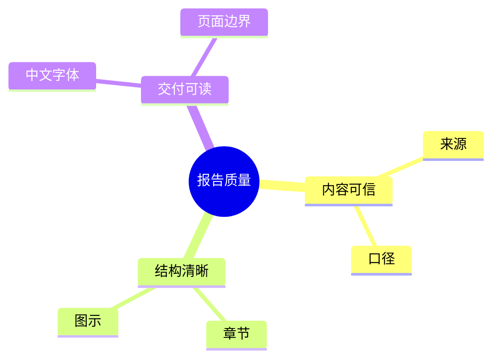
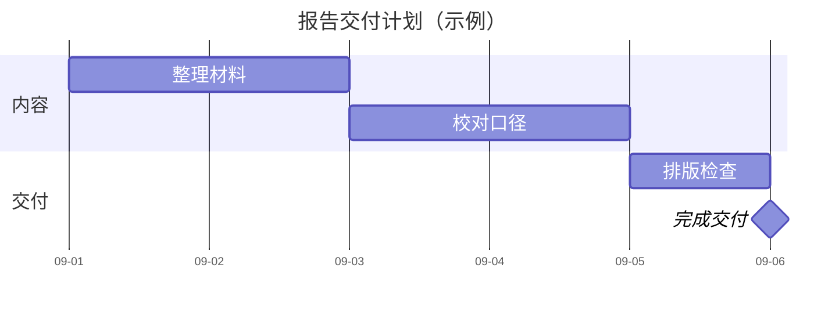

# 思维导图与 Gantt

它们分别表达概念层级和带日期的工作计划。思维导图的父子关系不是任务依赖，Gantt 的长度也不能代表未经给出的工作量估算。

## 思维导图（示例）

缩进定义层级；同层保持相同分类标准。文字过长时先重写标签；符号装饰和图标要核对目标渲染器。需要源文档图块时使用 `mermaid`，普通文章目录则可用标题表达。

## 日期与依赖（示例）

示例将 Gantt 原始宽度限制为 700，避免继承过大的渲染容器宽度后缩成小字；字号和条高一起调整。改写后按实际文档宽度复查，不机械沿用固定宽度。

任务 ID 与显示名分开；`after ID` 产生依赖，里程碑用零时长。此例使用自然日，未排除周末；如需工作日计划，明确假期/周末规则后再设置 exclusions。

## 校验与排版

对照日期和依赖确认任务不存在循环或错误起点。未提供工期时询问或标注假设，不把估算冒充确定日期。展示范围很长时按阶段分图，简化日期标签；保留读者需要的关键里程碑。

示例关闭 todayMarker，避免当前日期改变示例画面。用户需要当前进度时再启用并说明观察日期。

官方语法：[Mindmap](https://mermaid.js.org/syntax/mindmap.html)、[Gantt](https://mermaid.js.org/syntax/gantt.html)。
