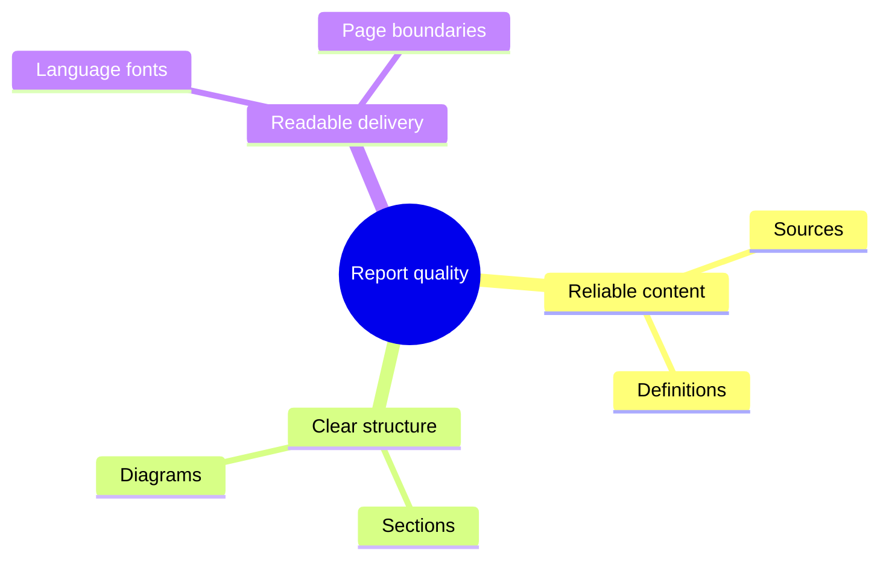
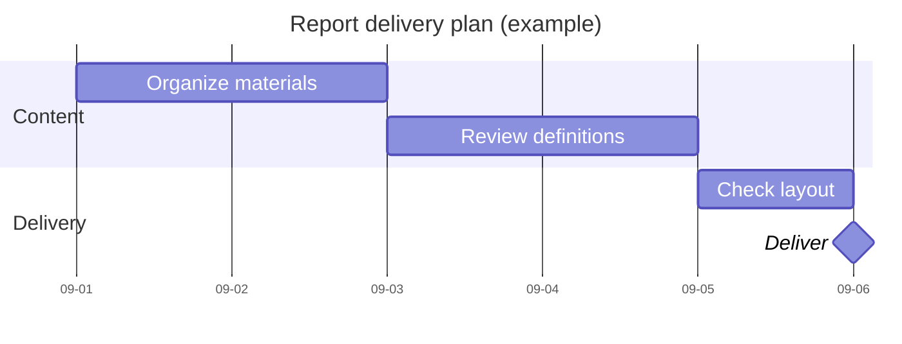

# Mindmaps and Gantt

These express concept hierarchies and dated work plans respectively. Mindmap parent-child relationships are not task dependencies, and Gantt lengths must not imply effort estimates absent from the source.

## Mindmap (example)

Indentation defines hierarchy; use the same classification criterion for siblings. Rewrite long labels first and verify decorations/icons against the target renderer. Use a `mermaid` fence for an in-document diagram; ordinary headings suffice for an article outline.

## Dates and dependencies (example)

The example limits native Gantt width to 700 to avoid tiny text after an oversized rendering container is scaled down; font size and bar height are adjusted together. Recheck the actual document width after adaptation rather than copying a fixed width mechanically.

Separate task IDs from display names. `after ID` establishes a dependency; milestones use zero duration. This example uses calendar days, including weekends. Establish holiday/weekend rules before setting exclusions for a working-day schedule.

## Validation and layout

Check dates and dependencies for cycles or incorrect starting points. Ask for missing durations or label assumptions rather than presenting estimates as fixed dates. Split long schedules by phase and simplify date labels while preserving key milestones.

The example disables todayMarker so the current date does not change its appearance. Enable it when current progress is requested and state the observation date.

Official syntax: [Mindmap](https://mermaid.js.org/syntax/mindmap.html), [Gantt](https://mermaid.js.org/syntax/gantt.html).
