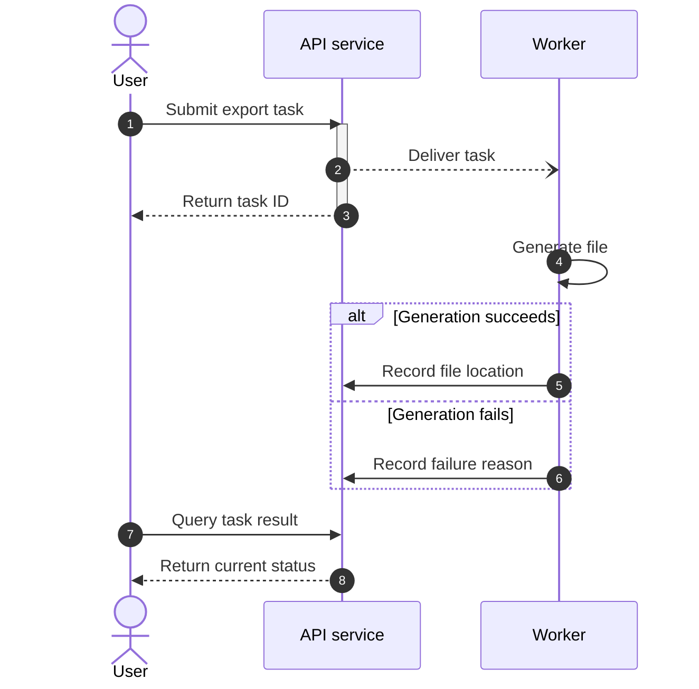

# Sequences: conditions, messages, and asynchronous work

Focus on message order, returns, and waiting. Mermaid and PlantUML arrows are not interchangeable: Mermaid commonly uses `->>` for calls, `-->>` for returns, and `-)` for open async arrowheads.

### Asynchronous request and result (example)

This example does not imply that the task always finishes before the first query. Add polling, notification, or timeout policies from the source for an actual workflow.

## Combined fragments

- `alt condition / else other condition / end` expresses mutually exclusive branches; `opt condition / end` expresses an optional step.
- `loop condition / end` expresses repetition. State the attempt limit and exhaustion exit for bounded retries.
- `par branch / and branch / end` expresses parallel work, with different separators from PlantUML.
- `Note over A,B: constraint` explains a cross-participant condition. Long notes widen the diagram; retain only essential short statements.
- Pair `activate/deactivate`. Ending activation on only some branch paths can create an incorrect lifecycle or parsing failure.

## Complex scenarios

A synchronous timeout does not prove the downstream operation did not execute. Retry diagrams should show the actual idempotency key or deduplication mechanism. Distributed compensation differs from database rollback: distinguish downstream failure from compensating completed steps. Add these mechanisms only when supported by the source or requirements.

Use aliases for long participant names. If repeated bottom participants make the diagram too tall, check the target version's sequence configuration. Split long flows by transaction and use consistent participants and numbering in prose.

Official syntax: [Sequence](https://mermaid.js.org/syntax/sequenceDiagram.html).
