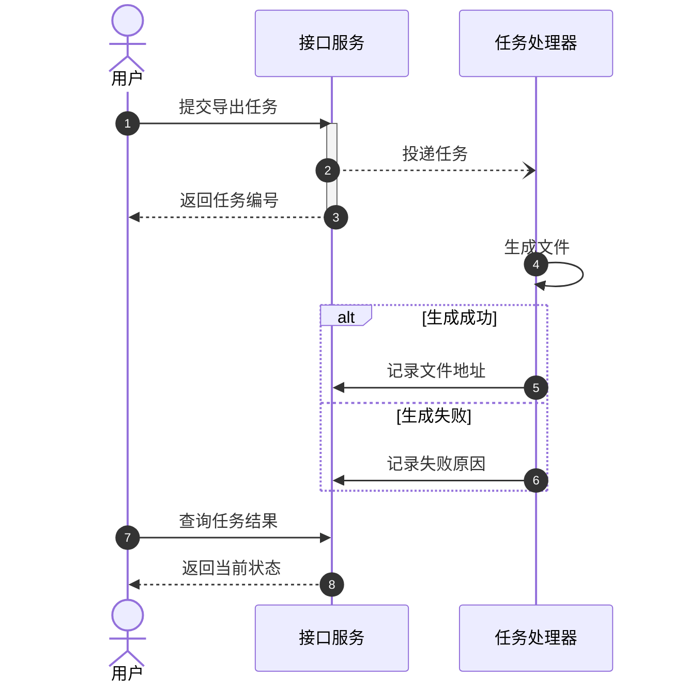

# 时序图：条件、消息与异步处理

重点是消息的先后、返回与等待。Mermaid 与 PlantUML 的箭头不能直接照搬：Mermaid 常用 `->>` 表示调用，`-->>` 表示返回，异步开放箭头可用 `-)`。

### 异步请求与处理结果（示例）

该例不暗示任务总在第一次查询前完成；生产流程应按来源补充轮询、通知或超时策略。

## 组合片段

- `alt 条件 / else 其他条件 / end` 表达互斥分支；`opt 条件 / end` 表达可选步骤。
- `loop 条件 / end` 表达重复；有限重试写出次数上限与耗尽出口。
- `par 分支 / and 分支 / end` 表达并行，区别于 PlantUML 的片段分隔语法。
- `Note over A,B: 约束` 解释跨参与者条件；长注释会拉宽图，保留关键短句。
- 激活块 `activate/deactivate` 成对；分支里只结束部分路径的激活可能导致错误生命周期或解析失败。

## 复杂场景

同步调用超时不等于下游没执行；重试图应表现幂等键或实际去重策略。分布式补偿不是数据库事务回滚，需分别标出后续失败与已完成步骤的补偿动作。源码或需求没有这些机制时不要自行加入。

参与者名称过长先用别名，重复的底部参与者影响高度时再核查目标版本的 sequence 配置。长流程按事务拆开，正文引用相同参与者和编号。

官方语法：[Sequence](https://mermaid.js.org/syntax/sequenceDiagram.html)。
