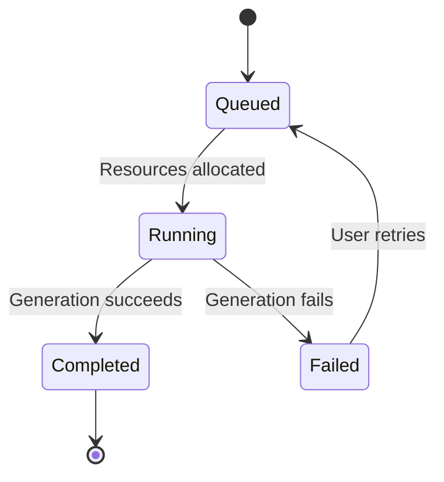
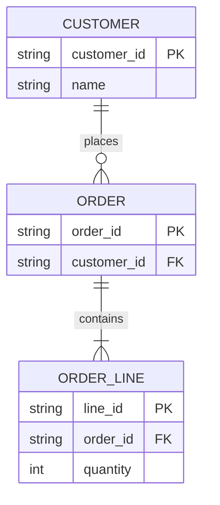

# State, class, and entity relationships

These types express lifecycles, type responsibilities, and persistent relationships. Choose the declaration that answers the user's question, preserving each type's member and arrow rules.

## State diagram (example)

States are lasting conditions; events label edges. `state Name { ... }` may contain substates, and each scope's `[*]` has its own meaning. Draw different objects' state machines separately.

## Class diagram (example)

Hollow triangles point to the parent/interface; composition diamonds sit at the whole end. Inheritance, interface implementation, and ordinary association are not interchangeable because they look similar. Quote cardinalities.

## ER diagram (example)

This example assumes at least one line per order. Change the cardinality if empty orders are allowed. PK/FK markers express constraints; field names alone do not establish uniqueness or nullability.

## Troubleshooting

Both structural examples use `htmlLabels: false` for SVG text, avoiding HTML label boundaries that can clip cardinalities or edge copy in the target environment. The configuration belongs in YAML frontmatter inside the diagram source, still within one complete Mermaid fence.

- Put the type declaration on its own line. Separate state aliases from display text and keep localized punctuation out of IDs.
- Use class-diagram relationship syntax; do not copy `erDiagram` crow's-foot arrows into class diagrams.
- Escape `|` when presenting it inside a Markdown table; preserve raw pipes in actual diagram source.
- Keep only states, types, or fields needed to explain the question and split by domain. More relationships and annotations often warrant separate detail views.

Official syntax: [State](https://mermaid.js.org/syntax/stateDiagram.html), [Class](https://mermaid.js.org/syntax/classDiagram.html), [ER](https://mermaid.js.org/syntax/entityRelationshipDiagram.html).
