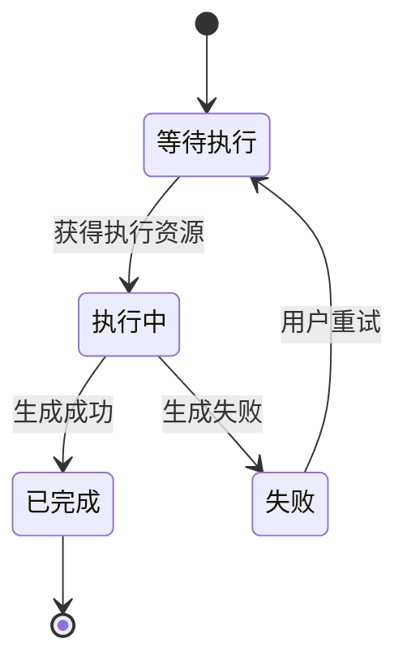
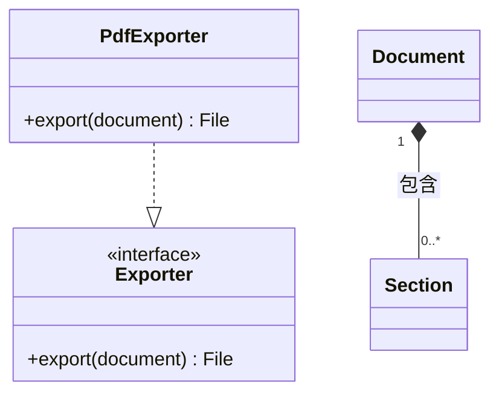
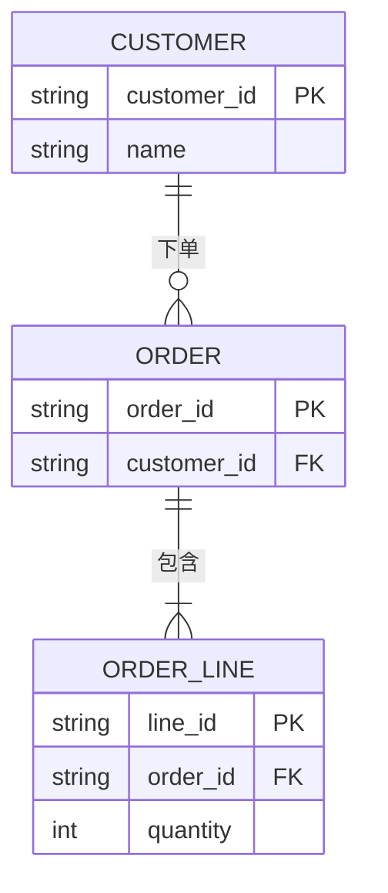

# 状态、类与实体关系

这三种类型分别表达生命周期、类型职责、持久化关系。先回答用户的问题，再选择相应声明，不能混用图类型的成员或箭头规则。

## 状态图（示例）

状态是持续条件，事件放边上。`state Name { ... }` 可包含子状态；每个作用域自己的 `[*]` 各有含义。不同对象的状态机分别画。

## 类图（示例）

空心三角指向父类/接口，组合菱形位于整体端。继承、接口实现与普通关联不能仅凭视觉相近互换；基数使用双引号。

## ER 图（示例）

示例假定订单至少有一条明细；若业务允许空订单，需修改对应基数。PK/FK 标记说明数据约束，不能从字段命名猜测唯一性或可空性。

## 排错

这两个结构图示例使用 `htmlLabels: false` 输出 SVG 文字，避免目标环境中 HTML 标签边界导致基数或边文案被裁切。配置写在图源码的 YAML frontmatter 中，仍是一个完整 Mermaid 围栏。

- 类型声明独占首行；状态别名与显示文字分别写，避免中文标点进入 ID。
- 类关系使用类图语法，不能把 `erDiagram` 的乌鸦脚箭头复制到类图。
- Markdown 表格内展示 `|` 时转义，实际图源码中保持原始管道字符。
- 只保留解释问题需要的状态、类型或字段，按领域拆图；关联线与说明越多，越需要单独的细节图。

官方语法：[State](https://mermaid.js.org/syntax/stateDiagram.html)、[Class](https://mermaid.js.org/syntax/classDiagram.html)、[ER](https://mermaid.js.org/syntax/entityRelationshipDiagram.html)。
