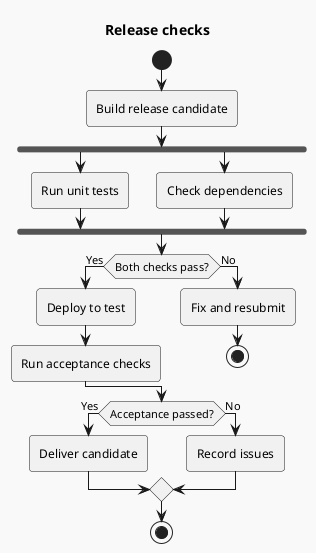
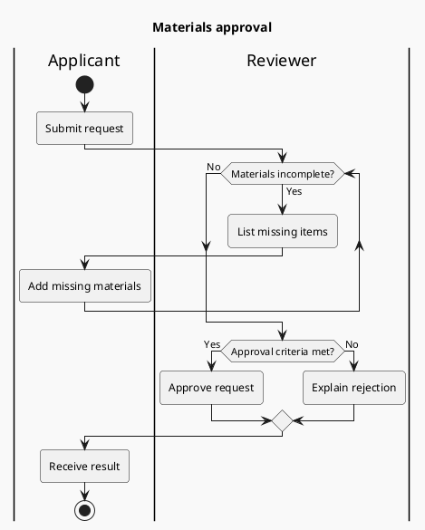
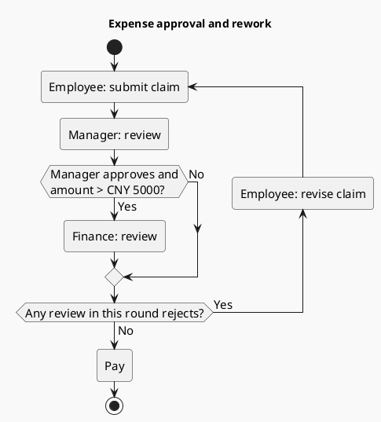

# Activity diagrams and swimlanes

Use to explain conditions for the next step, failure destinations, and step ownership. The focus is control flow; use sequences for the timing of requests across systems.

## Modeling

List starts, actions, decisions, and exits first. Write actions as verb phrases and decisions as answerable questions. Use `if/else/endif` for mutually exclusive choices and `fork/fork again/end fork` for concurrent tasks that all execute. State loop continuation and exit conditions; do not depict bounded retries as infinite loops.

### Conditions and parallelism: release checks (example)

`end fork` joins parallel branches. Do not depict an “either one” choice as waiting for all branches.

### Swimlanes and rework: materials approval (example)

Actions after a swimlane marker belong to that role until the next switch. Return to the correct owner after a loop. Edges represent handoffs, not reporting lines in an organization.

### Less nesting and merging: expense approval (example)

Finance review runs only when the manager approves and the amount exceeds CNY 5,000. Rejection by any review performed in the current round sends the employee to revise and resubmit, restarting manager review. Exactly CNY 5,000 does not trigger finance review. Payment follows all required approvals.

A compound condition gates finance review, reducing nested merges. `repeat :action;` uses submission itself as the return target. Combine conditions only when facts remain equivalent and readers can still identify responsibilities and thresholds. Use separate decisions or an overview plus a single-review subprocess when individual outcomes need emphasis. The rejection check reads only reviews performed in this round, never stale results from a previous round.

## Connector clarity checks

Trace success, rejection, and rework paths, then inspect the chosen rendered layout:

- **Purposeful merges:** Distinguish mutually exclusive path merging from parallel synchronization. Check whether empty branches, successive unlabeled diamonds, or nesting merely add detours. Combine equivalent conditions or use an action as the loop entry; split out a subprocess when responsibilities or exceptions should not be compressed.
- **Traceable direction:** Keep branch labels close to their exits and route rework to the step that must repeat. Intermediate arrowheads are a common result of segmented activity connectors. Check for misleading reversal, disconnection, or extra steps; reorganize ambiguous paths before rerendering.
- **Preserved control flow:** Do not replace rejection/rework with `stop` or turn an exclusive merge into parallel synchronization for appearance. `skinparam ArrowHeadColor none` hides arrowheads throughout the diagram, not only intermediate ones; it is not a selective fix. Do not delete arrowheads from the generated SVG.

Completion means key conditions and responsibilities are readable, every exit/merge/loop is explainable, and corrections preserve the conditions for payment or resubmission. Normal direction markers need not be eliminated to achieve “zero intermediate arrowheads.” Check at least: manager rejection; manager approval with an amount equal to or below 5,000; finance approval/rejection above 5,000; and resubmission after revision.

## Adaptation and layout

- Use `repeat ... repeat while (...)` when the body executes before checking; use `while ... endwhile` when checking before execution.
- Consider `!pragma useVerticalIf on` for several long conditions, after trying shorter decision labels or a separate subprocess.
- Many swimlanes make a diagram wide. Include only roles involved in the current process, not a separate lane per action.
- Bounded retries need attempt limits, failure exits, and success exits. Do not add retries absent from the source merely for completeness.
- Check semicolons in `:action;`, branch closures, and lane switches. Do not mix in legacy activity-node arrow syntax.

Official syntax: [Activity](https://plantuml.com/activity-diagram-beta); intermediate arrowheads: [official forum discussion](https://forum.plantuml.net/18079/activity-diargram-remove-arrow-heads-at-junctions).
