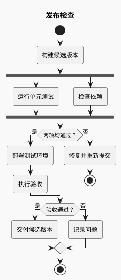
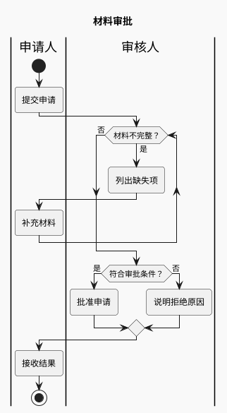
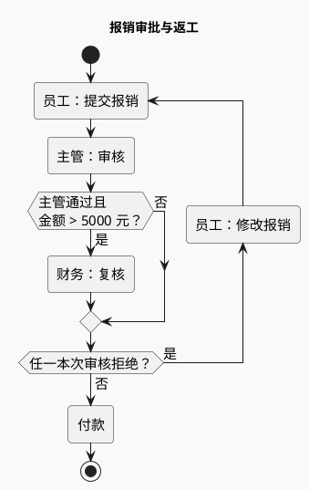

# 活动图与泳道

用于回答“满足什么条件才进入下一步”“失败后去哪”“这一步由谁负责”。读图重点是控制流；跨系统请求的时间关系用时序图。

## 建模

先列出起点、动作、判定、出口；动作写动词短语，判定写可判断的问题。互斥选择用 `if/else/endif`，全部执行的并发任务用 `fork/fork again/end fork`。循环要标明继续与退出条件，避免把有限重试画成无限循环。

### 条件与并行：发布检查（示例）

`end fork` 表示并行分支汇合，不能将“任选其一”表达成必须等待全部完成。

### 泳道与返工：材料审批（示例）

泳道标记之后的动作属于该角色，直到下一次切换。循环后应回到正确责任人；边表示交接，不是组织汇报关系。

### 减少嵌套与合流：报销审批（示例）

主管通过且金额超过 5000 元才执行财务复核；任一本次已执行的审核拒绝，员工修改后重新提交，重新从主管审核开始。5000 元整不触发财务复核，全部必要审核通过后付款。

这里用一个联合条件控制财务复核，减少嵌套后逐层合流；`repeat :动作;` 直接以提交动作作为返回目标。联合条件仅在事实等价且读者仍能识别责任与门槛时使用；需要逐级展示审核结果时，分别画判定，或拆成总览与单次审核子流程。本例的拒绝判定只读取本次已执行的审核结果，不能沿用上一轮结果。

## 连线简洁性检查

先沿成功、拒绝和返工路径逐条走读，再查看正常与窄版成品：

- **合流有用途**：区分互斥路径合流与并行同步；检查空分支、连续无文字菱形和逐层嵌套是否只增加绕行。事实等价时合并条件、以动作作为循环入口；责任或异常不宜压缩时拆出子流程。
- **方向可追踪**：分支标签靠近所属出口，返工明确回到应重新执行的步骤。中途箭头属于活动图分段连线的常见表现；检查它是否造成反向、断路或额外步骤的错觉，出现歧义时先重组路径，再渲染。
- **保留控制流语义**：不能为美化把拒绝后的返工改成 `stop`，或把互斥合流改成并行同步。`skinparam ArrowHeadColor none` 会隐藏全图箭头头部，不作为仅移除中途箭头的修复方式；也不直接删除生成 SVG 中的箭头。

完成条件：关键条件和责任可读，每个出口、合流及回路可解释；修复没有改变到达付款或重新提交的条件。正常方向标记无需为追求“零中途箭头”而消除。报销例至少核对：主管拒绝；主管通过且金额等于/小于 5000；金额超过 5000 时财务通过/拒绝；修改后再次提交。

## 改写与排版

- 需要先执行一次再判断时用 `repeat ... repeat while (...)`；先判断能否执行时用 `while ... endwhile`。
- 多个长条件可考虑 `!pragma useVerticalIf on`，但先尝试缩短判定标签或拆出子流程。
- 泳道一多就会显著变宽；只保留参与当前流程的角色。不要为每个动作建独立泳道。
- 有限重试需要次数、失败出口和成功出口。源码没有重试时不能为了完整感添加重试。
- `:动作;` 的分号、分支结束标记和泳道切换是排错重点；不要混入旧活动图的节点箭头写法。

官方语法：[活动图](https://plantuml.com/activity-diagram-beta)；中途箭头行为见 [官方论坛讨论](https://forum.plantuml.net/18079/activity-diargram-remove-arrow-heads-at-junctions)。
