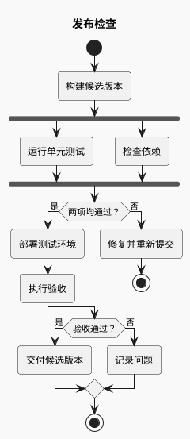
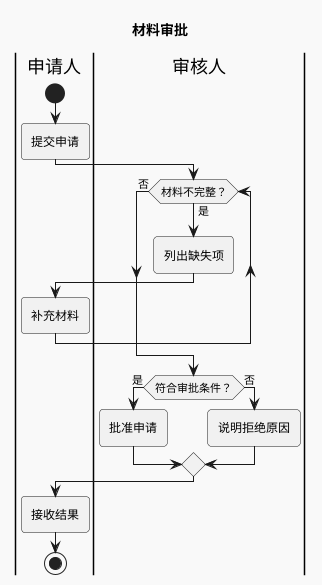

# 活动图与泳道

用于回答“满足什么条件才进入下一步”“失败后去哪”“这一步由谁负责”。读图重点是控制流；跨系统请求的时间关系用时序图。

## 建模

先列出起点、动作、判定、出口；动作写动词短语，判定写可判断的问题。互斥选择用 `if/else/endif`，全部执行的并发任务用 `fork/fork again/end fork`。循环要标明继续与退出条件，避免把有限重试画成无限循环。

### 条件与并行：发布检查（示例）

`end fork` 表示并行分支汇合，不能将“任选其一”表达成必须等待全部完成。

### 泳道与返工：材料审批（示例）

泳道标记之后的动作属于该角色，直到下一次切换。循环后应回到正确责任人；边表示交接，不是组织汇报关系。

## 改写与排版

- 需要先执行一次再判断时用 `repeat ... repeat while (...)`；先判断能否执行时用 `while ... endwhile`。
- 多个长条件可考虑 `!pragma useVerticalIf on`，但先尝试缩短判定标签或拆出子流程。
- 泳道一多就会显著变宽；只保留参与当前流程的角色。不要为每个动作建独立泳道。
- 有限重试需要次数、失败出口和成功出口。源码没有重试时不能为了完整感添加重试。
- `:动作;` 的分号、分支结束标记和泳道切换是排错重点；不要混入旧活动图的节点箭头写法。

官方语法：[活动图](https://plantuml.com/activity-diagram-beta)。
