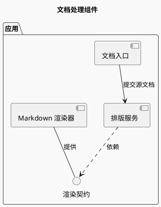
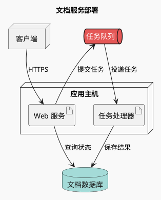

# 组件架构与部署

组件图回答“职责与依赖”；部署图回答“运行在哪里、如何连接”。先选抽象层次：系统边界 → 进程/服务 → 内部组件。一个节点不要同时代表整个业务系统和某个方法。

## 组件与接口（示例）

分组表示实际模块或系统边界；`..>` 表示依赖，接口提供方连接到接口。若业务只需要粗略流向，可简化接口节点，但保留依赖方向。

## 部署与网络边界（示例）

这是示例拓扑，不代表实际项目配置。真实部署图需从配置中验证主机、容器、集群、端口、协议、实例数和外部依赖。

## 源码到架构

- 代码 import 证明编译依赖，不证明运行时会访问该节点；时序消息要进一步读调用路径。
- 同一服务多实例可用一个节点加“副本数”说明，只有可用区/故障域差异与任务有关时展开。
- 数据流箭头与“依赖于”箭头含义不同；统一一种主语义，确需混用时提供图例和明确标签。
- 云厂商图标不是必要条件；标准 `node`、`artifact`、`database` 能清晰说明部署，且无需环境专属扩展。
- 当层级过多、跨区边很多时拆出总览、内部组件与部署三种视图；不要重复画无差别信息。

源码取证流程见 [code-to-diagram.md](../code-to-diagram.md)。

官方语法：[组件](https://plantuml.com/component-diagram)、[部署](https://plantuml.com/deployment-diagram)。
