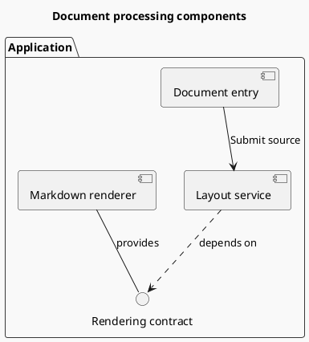
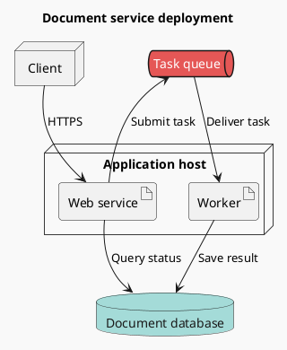

# Component architecture and deployment

Components explain responsibilities and dependencies; deployment explains runtime locations and connections. Choose the abstraction level first: system boundary → process/service → internal component. A node must not simultaneously represent a whole business system and a method.

## Components and interfaces (example)

Groups represent actual module or system boundaries. `..>` represents dependency, and interface providers connect to the interface. Simplify interface nodes when only coarse flow matters, while preserving dependency direction.

## Deployment and network boundaries (example)

This is an illustrative topology, not actual project configuration. Verify hosts, containers, clusters, ports, protocols, replica counts, and external dependencies from configuration for a real deployment diagram.

## From code to architecture

- Imports establish compile-time dependencies, not runtime access to a node. Read call paths for sequence messages.
- Several replicas of one service can be one node with a replica-count note. Expand availability zones or failure domains only when their differences matter to the task.
- Dataflow and “depends on” arrows mean different things. Prefer one main semantics; when combining them, supply a legend and explicit labels.
- Cloud-provider icons are optional. Standard `node`, `artifact`, and `database` elements explain deployment without environment-specific extensions.
- If there are too many levels or cross-zone edges, separate overview, internal-component, and deployment views; avoid repeating identical information.

See [code-to-diagram.md](../code-to-diagram.md) for source evidence.

Official syntax: [Component](https://plantuml.com/component-diagram), [Deployment](https://plantuml.com/deployment-diagram).
