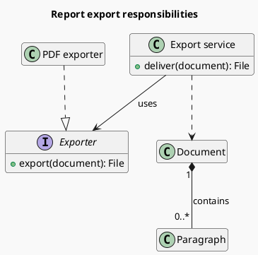
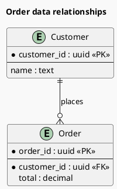

# Classes and entity relationships

Class diagrams explain responsibilities, interfaces, properties, and type relationships; ER diagrams explain persistent entities, primary/foreign keys, and cardinalities. Determine whether the question concerns the code model or the data model.

## Class relationships

- `Child --|> Parent` is inheritance; `Implementation ..|> Contract` is interface realization. The triangle points to the more general type.
- `Whole *-- Part` is composition, with the filled diamond at the whole. Use only when the whole owns the part's lifecycle.
- `Owner o-- Member` is shared aggregation. Holding a reference does not automatically warrant aggregation; ordinary association is often clearer.
- `A ..> B` is dependency; `A --> B` is navigable association. Quote cardinalities at each end.
- Members may use `+`, `-`, and `#` for visibility. Retain only members needed to explain the current design.

### Interfaces and responsibilities (example)

### Persistent relationships (example)

Each order belongs to exactly one customer; a customer may have zero or many orders. `*` marks a required attribute, distinct from the `<<PK>>` primary-key marker.

## Validation and layout

Verify foreign-key nullability, uniqueness, and actual cardinalities from model definitions or table structures. One-to-many does not imply composition. Show the association table when a many-to-many schema requires it; a single edge must not hide important fields. Include only relevant interfaces for external types and group by domain rather than copying an entire schema or all methods into one diagram.

Escape pipe characters inside Markdown table cells; keep `|` unchanged in standalone code fences.

Official syntax: [Class](https://plantuml.com/class-diagram), [Information Engineering](https://plantuml.com/ie-diagram).
