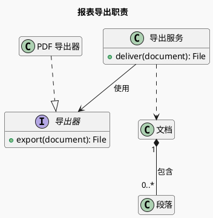
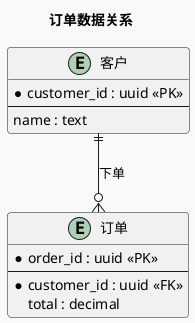

# 类图与实体关系

类图解释职责、接口、属性和类型关系；实体关系图解释持久化实体、主外键及基数。先判断用户要理解代码模型还是数据模型。

## 类关系

- `Child --|> Parent` 为继承，`Implementation ..|> Contract` 为接口实现，三角形指向更一般的类型。
- `Whole *-- Part` 为组合，实心菱形在整体端；只有部分的生命周期由整体拥有时使用。
- `Owner o-- Member` 为共享聚合；仅持有引用并不自动需要聚合符号，普通关联往往更明确。
- `A ..> B` 为依赖；`A --> B` 为可导航关联。基数放在两端双引号内。
- 成员可用 `+`、`-`、`#` 表示可见性；图只保留解释当前设计需要的成员。

### 接口与职责（示例）

### 持久化关系（示例）

此例表示每个订单恰好属于一个客户，一个客户可以没有订单或拥有多个订单。`*` 标识必填属性，与 `<<PK>>` 的主键标记是不同信息。

## 校验与排版

从模型定义或表结构验证外键可空性、唯一约束和真实基数；一对多不等于组合关系。多对多表结构需要展示关联表时就画出它，不能用一条边隐藏关键字段。引用外部类型只列相关接口，按领域分组，避免把整份 schema 或所有方法塞进一张图。

Markdown 表格单元内的管道字符要转义；独立代码块里的 `|` 保持原样。

官方语法：[类图](https://plantuml.com/class-diagram)、[Information Engineering](https://plantuml.com/ie-diagram)。
