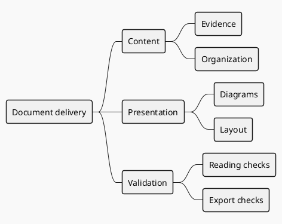
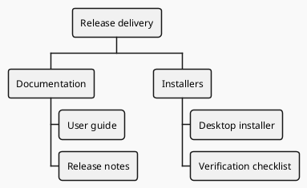

# Mindmaps and work breakdowns

Mindmaps organize concepts; WBS breaks down work or deliverables. Both express hierarchy, not conditional branches or sequential dependencies. Use a timeline or Gantt when dates and progress are central.

## Concept hierarchy (example)

## Work breakdown (example)

## Detail and validation

- The number of `*` characters defines depth. Children belong to their parent; siblings share a classification criterion.
- Mixing departments, stages, and tools at the same level often signals inconsistent classification. Reorganize content before changing colors.
- Prefer verifiable deliverables as WBS leaves. Task order is not a parent-child relationship.
- Wrap long labels. For many nodes, show a two- or three-level overview with detail views for key branches. Normal reading should not require full-screen enlargement.
- Keep the `plantuml` fence but preserve type-specific `@startmindmap` / `@endmindmap` or `@startwbs` / `@endwbs` markers rather than replacing them with `@startuml`.

Official syntax: [Mindmap](https://plantuml.com/mindmap-diagram), [WBS](https://plantuml.com/wbs-diagram).
