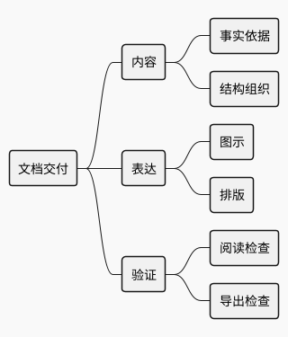
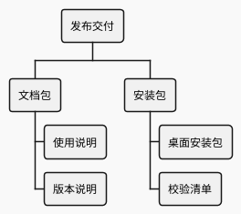

# 思维导图与工作分解

思维导图组织概念；WBS 分解要交付的工作或成果。它们都表达层级，不表达条件分支或前后依赖。若重点是日期与进度，应使用时间线或 Gantt。

## 概念层级（示例）

## 工作分解（示例）

## 深化与校验

- `*` 数量表示深度，子项都应属于父项，兄弟项保持同一分类标准。
- 同一层级混入“部门”“阶段”“工具”常说明分类轴不一致；先重组内容，再改颜色。
- WBS 的叶节点尽量是可验收成果，不要把活动先后误作父子关系。
- 长标签分行；节点过多时展示两到三层总览，再给重点分支提供细图。不要让正文只能在全屏放大后读清。
- 围栏仍用 `plantuml`，但起止标记是类型专用的 `@startmindmap` / `@endmindmap` 或 `@startwbs` / `@endwbs`，不能统一替换成 `@startuml`。

官方语法：[Mindmap](https://plantuml.com/mindmap-diagram)、[WBS](https://plantuml.com/wbs-diagram)。
