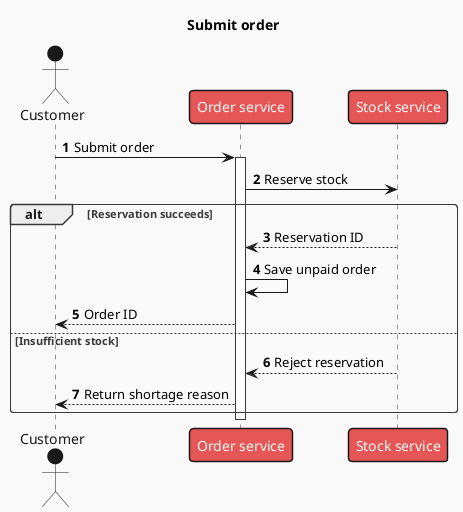
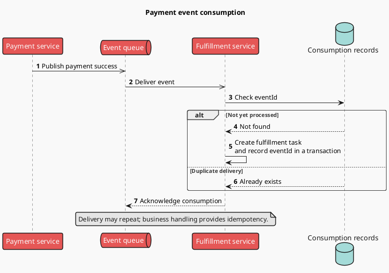

# Sequences: calls, asynchronous work, and compensation

Explain who initiates each message, who waits, and how failure is handled. Extract participants and observable messages from the source before adding conditions. Time runs downward; participants run left to right.

## Message semantics

- `->` expresses synchronous calls and `-->` returns. Use `->>` for async messages, with copy identifying publication/delivery.
- `alt/else/end` denotes mutually exclusive paths, `opt/end` optional work, `loop/end` repetition, and `par/else/end` parallel work.
- Pair `activate` / `deactivate` within call scopes. If branching makes activation hard to keep correct, omitting it is clearer than depicting an incorrect lifecycle.
- Use `autonumber` for references from prose, `box ... end box` to group many participants, and line breaks for long messages.

### Synchronous transaction and failure exit (example)

### Async delivery and idempotent consumption (example)

This example shows only the consumer. Diagram actual mechanisms such as an outbox separately when explaining consistency between producer persistence and publication.

## Extended patterns

- Timeout: identify who times out, whether downstream work is cancelled, and what follows. A caller timeout does not prove downstream failure.
- Retry: use `loop at most N attempts / retryable errors only`, exit on success, and show an explicit exhaustion path.
- Compensation: use `alt downstream step fails` for undo actions established by the source, such as releasing a reservation. Compensation can fail; include manual handling or retries only as supported by evidence.
- Long sequences: retain key interactions in the main view and use `ref over A, B : Subprocess name` to reference a detail diagram actually supplied.

## Troubleshooting and layout

Each message needs a colon and text; each branch frame needs a closing marker. Shortening participant names is more effective than shrinking the whole image. Split by transaction or stage if the diagram exceeds reading width, retaining consistent participants and event IDs. Do not let a “main flow succeeds” label obscure real failure branches.

Official syntax: [Sequence](https://plantuml.com/sequence-diagram).
