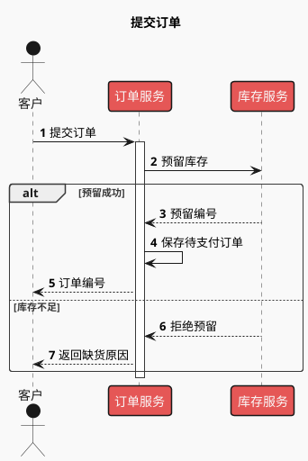
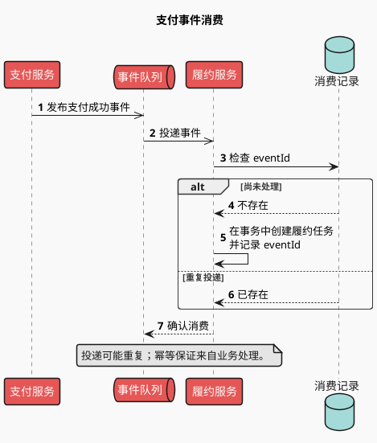

# 时序图：调用、异步与补偿

用于回答“谁先发起什么消息，谁在等待，失败如何处理”。先从来源提取参与者和可观测消息，再表达条件；时间自上而下，参与者从左到右。

## 消息语义

- `->` 表达同步调用，`-->` 表达返回；异步消息可用 `->>`，同时在文案说明发布/投递。
- `alt/else/end` 为互斥路径，`opt/end` 为可选步骤，`loop/end` 为重复，`par/else/end` 为并发。
- 执行条用 `activate` / `deactivate`，按调用范围成对管理。若跨分支难以保持正确，省略执行条也比错误生命周期清楚。
- 用 `autonumber` 方便正文引用步骤；参与者多时用 `box ... end box` 分组，长消息分行。

### 同步事务与失败出口（示例）

### 异步投递与幂等消费（示例）

此例只展示消费端；需要解释生产端落库与发布一致性时另画 outbox 等实际存在的机制。

## 扩展模式

- 超时：标出谁超时、是否取消下游和随后动作；调用方超时并不证明下游失败。
- 重试：`loop 最多 N 次 / 仅可重试错误`，成功后退出，耗尽后走明确失败路径。
- 补偿：以 `alt 后续步骤失败` 展示已有事实需要的撤销动作，例如释放预留；补偿可能失败，应按来源说明人工处置或重试。
- 长时序：主图保留关键交互，用 `ref over A, B : 子流程名称` 指向实际提供的细节图；不要依赖不存在的子图。

## 排错与布局

每条消息都有冒号和文本，分支框都有结束标记。缩短参与者名比整体缩图更有效。超过阅读宽度时按事务或阶段拆图，跨图保留同名参与者和事件 ID。避免让图上方的“主流程成功”遮蔽实际失败分支。

官方语法：[时序图](https://plantuml.com/sequence-diagram)。
