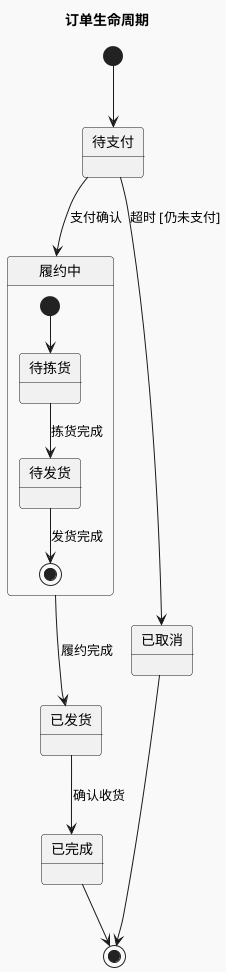

# 状态图：生命周期与嵌套状态

先确定“谁的状态”。同一图描述同一对象或状态机；订单、支付和发货各自的状态不要混成一个生命周期。

## 状态与迁移

状态是持续存在的条件，如“待支付”；“支付”通常是事件或动作。迁移标签可写 `事件 [条件] / 动作`。`[*]` 在不同嵌套作用域内分别表示初始或最终伪状态。

### 带子状态的履约过程（示例）

## 进阶选择

- 同一对象在一个大阶段内还有小阶段，使用复合状态；不要仅为装饰增加嵌套。
- 不同维度确实同时运行时才用并行区域。并行的“付款校验”和“风险校验”不能误画为串行状态。
- `State : entry / 动作` 与 `State : exit / 动作` 适合进入/离开状态必然触发的行为；普通自迁移是否重新进入状态要与实现一致。
- 历史状态用于恢复先前子状态。只有来源明确存在恢复语义时才使用，并核对当前服务的 history 语法。

## 校验

每个业务状态均有合理入口或被说明为孤立状态；终态不再发起业务迁移。相同事件的不同出口应有互斥条件。检查超时与成功事件竞争时系统到底采用什么判定，不能凭画图需要自行消除竞争。

过宽时回到上下方向；过高时将复合状态展开为独立图。不要用巨大的 note 复制状态说明表。

官方语法：[状态图](https://plantuml.com/state-diagram)。
