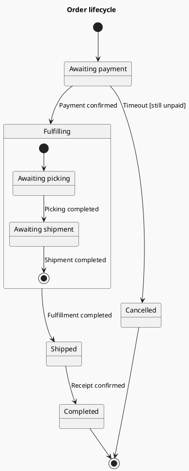

# States: lifecycles and nested states

Establish whose state is represented. One diagram describes one object or state machine; do not combine order, payment, and shipment states into a single lifecycle.

## States and transitions

A state is a lasting condition such as “Awaiting payment”; “Pay” is usually an event or action. Transition labels may use `event [guard] / action`. `[*]` denotes an initial or final pseudostate within its own nested scope.

### Fulfillment with substates (example)

## Advanced choices

- Use a composite state when the same object has substages within a larger stage, not as decoration.
- Use parallel regions only for genuinely simultaneous dimensions. Do not depict concurrent payment and risk checks as sequential states.
- `State : entry / action` and `State : exit / action` suit behavior that always runs on entry/exit. Match whether self-transitions reenter a state to the implementation.
- History restores a previous substate. Use it only when the source establishes restoration semantics, and verify history syntax for the target service.

## Validation

Every business state needs a reasonable entry or an explanation of isolation; final states initiate no further business transitions. Different exits for the same event need mutually exclusive guards. Verify how the system resolves competing timeout and success events rather than eliminating the race for drawing convenience.

Try vertical direction for excessive width, or expand a composite state into a separate diagram for excessive height. Do not copy a state-description table into an oversized note.

Official syntax: [State](https://plantuml.com/state-diagram).
