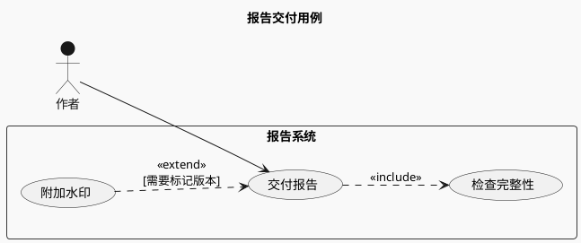
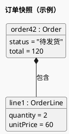
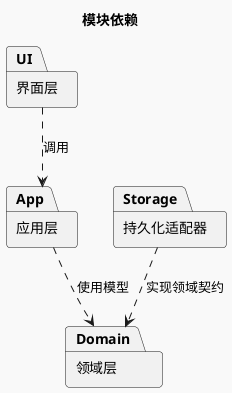

# 用例、对象与包图

这些图解决不同问题，按当前任务只选其中一种。

## 用例：角色能完成什么目标

用例不是页面清单或执行顺序。系统边界内画能力，边界外画角色；`include` 的箭头指向必需复用的用例，`extend` 的箭头指向被扩展的基本用例。

这里完整性检查总会发生，水印为条件性扩展。若实际业务并非如此，应改关系而不是沿用示例。

## 对象：某一时刻的具体实例

从故障现场或示例输入解释“这些实例如何关联”，用对象图；类型职责用类图。

显示的是实例值而非类字段声明；数据脱敏与来源标记遵从任务约束。例子的数量、单价与总额应自洽。

## 包：模块分层与依赖

依赖方向以源码为准，不能按分层架构教科书自动补边。发现循环依赖时保留它并解释，不能通过移动节点假装依赖消失。

官方语法：[用例](https://plantuml.com/use-case-diagram)、[对象](https://plantuml.com/object-diagram)、[包与类组织](https://plantuml.com/class-diagram)。
