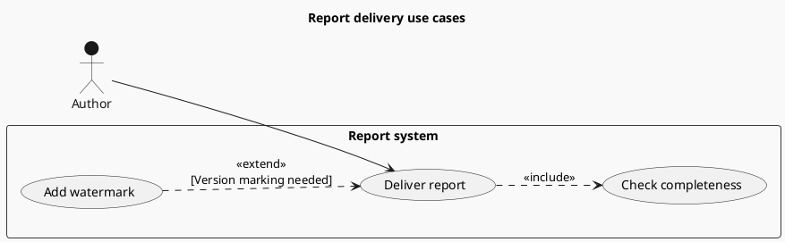
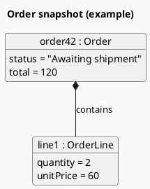
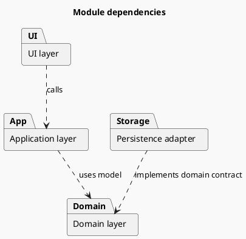

# Use case, object, and package diagrams

These solve different questions; select the one relevant to the current task.

## Use cases: goals an actor can accomplish

Use cases are neither page lists nor execution sequences. Put capabilities inside the system boundary and actors outside. An `include` arrow points to the required reused use case; an `extend` arrow points to the base use case being extended.

Completeness checking always occurs here; watermarking is conditional. Change the relationships if the real business differs rather than copying the example's assumptions.

## Objects: concrete instances at a moment in time

Use object diagrams to explain instance relationships from an incident or example input; use class diagrams for type responsibilities.

These are instance values, not class field declarations. Follow task constraints for redaction and source labeling. Keep example quantity, unit price, and total consistent.

## Packages: module layers and dependencies

Derive dependency directions from source rather than automatically adding textbook layers. Preserve and explain cyclic dependencies; moving nodes does not remove the cycle.

Official syntax: [Use case](https://plantuml.com/use-case-diagram), [Object](https://plantuml.com/object-diagram), [Package/class organization](https://plantuml.com/class-diagram).
